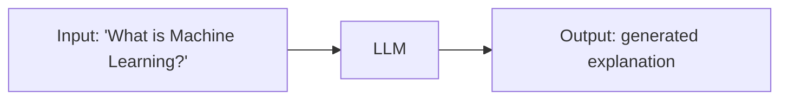
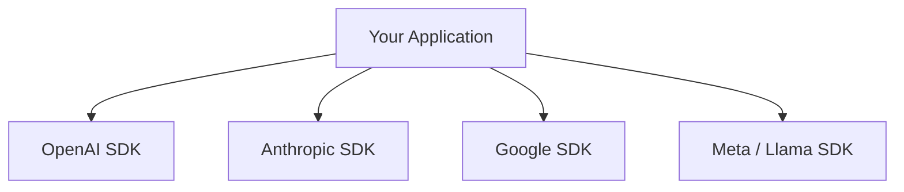
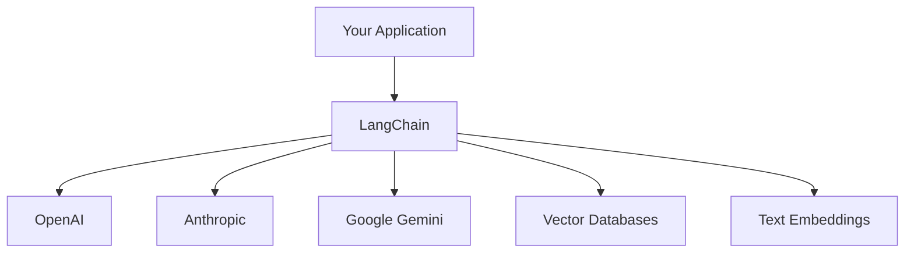
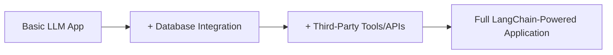
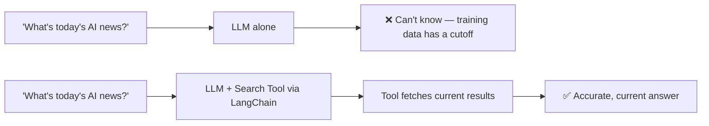
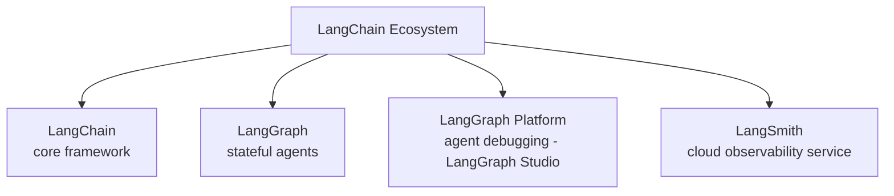
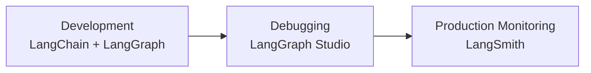

# LangChain — What It Is and Why It Exists

This is the first framework in the Generative AI / Agentic AI application-building path. Before writing any code with it, it's worth understanding precisely what problem LangChain solves — because the framework only makes sense once you understand what building without it actually looks like.

---

## 1. What Is LangChain?

**Definition:** LangChain is a framework for developing applications powered by LLMs (Large Language Models).

An LLM on its own does one core thing very well: **content generation**. Given an input, it produces an output — answering a question, summarizing text, generating code, translating language. This works because LLMs are trained on massive amounts of data already available on the internet, which is exactly why major tech companies (OpenAI, Google, Microsoft, Anthropic) — the ones with access to that scale of data — are the ones building these models.



That input-output pattern is the foundation of everything you can build on top of an LLM — a chatbot, a content tool, a full application — all of it is this same core loop, wrapped in a specific interface.

---

## 2. Why Not Just Use an LLM Directly?

This is the real question worth answering, because it's the entire reason a framework like LangChain exists.

**The problem:** there isn't just one LLM. There's OpenAI's models, Meta's Llama, Anthropic's Claude, Google's Gemini — and more arriving constantly. Each provider typically ships its own SDK/library for accessing its models.



Without a shared framework, integrating a new provider means learning an entirely new library each time. And in practice, building LLM applications involves a lot of rapid experimentation — trying one model, checking how it performs, swapping to another model, comparing results. If every swap meant rewriting your integration code from scratch, that experimentation loop becomes painfully slow.

**The solution LangChain provides:** a single, generic framework that lets you write one consistent style of code, and swap the underlying LLM (or vector database, or embedding model) without rewriting your application's core logic.



This is the core reason to use LangChain: it removes backend-specific tension around *which* model or *which* database you're integrating — the integration technique stays common across all of them.

---

## 3. What LangChain Simplifies

LangChain simplifies every stage of the LLM application lifecycle — development, productionization, and deployment. Two properties matter immediately:

- **LangChain is largely open source.** Most of its components are free to use and integrate. Some cloud-hosted services and certain third-party API integrations involve paid tiers, but the core framework components are open source.
- **LangGraph** (a related project) is specifically built for creating **stateful agents** — with first-class support for streaming responses and human-in-the-loop workflows (where a human can review or approve a step before the agent continues).



### A Concrete Example of Why Integration Matters

Suppose you ask an LLM: *"What is the latest AI news today?"* An LLM's knowledge comes from training data collected up to a certain point — it is periodically retrained, not continuously updated with today's events. So it genuinely cannot answer this correctly from its own training alone.



This is exactly where **third-party tool integration** comes in. A tool like the Tavily API (a third-party search engine built specifically to integrate with LLM applications) can be wired in through LangChain, giving the LLM access to current search results it wouldn't otherwise have. The analogy: if you have a book and it doesn't contain the answer you need, you go find a different reference source. An LLM does the same thing here — when its own training data can't answer a question, it reaches for a connected tool instead.

**The direct benefit:** your application becomes less dependent on the LLM's built-in knowledge alone. The LLM stays excellent at content generation, while the additional context supplied through database or tool integration is what makes the final output accurate. Since the whole point of a Generative AI application is producing accurate, useful output, this combination is what actually makes such applications production-worthy.

**Code shape (conceptual — actual LangChain syntax comes in later, code-focused notes):**

```javascript
// Without a tool: the LLM can only answer from its training data
const basicAnswer = await llm.invoke("What's today's AI news?");
// Unreliable — no access to current events

// With a tool integration (e.g., a search API wired in via LangChain):
const agentWithTool = createAgent({
  llm,
  tools: [tavilySearchTool],
});
const groundedAnswer = await agentWithTool.invoke("What's today's AI news?");
// The agent recognizes it needs current data, calls the search tool,
// and generates its answer using those real, current results
```

Beyond search tools, this same integration pattern applies to vector databases (for retrieving your own private data — the foundation of RAG) and to building AI agents generally, which LangChain and its related tools support directly.

---

## 4. The LangChain Ecosystem

LangChain isn't a single library — it's a full ecosystem of related tools, each solving a different part of building and running LLM applications.



| Component | What it's for |
|---|---|
| **LangChain** | The core framework — building a standard LLM-powered application: input in, output out, with model/tool/database integrations |
| **LangGraph** | Purpose-built for creating AI agents — including stateful agents, multi-step agents, and multi-agent systems |
| **LangGraph Platform (LangGraph Studio)** | A tool specifically for debugging AI agents you've built — inspecting what an agent did and why |
| **LangSmith** | A cloud service for debugging, running a prompt playground, managing prompts, annotating outputs, testing, and monitoring your application in production |

**Integrations, more broadly:** beyond models and search tools, LangChain also supports **data parsing integrations** — for example, reading PDFs, reading Excel files, or scraping content from a website to build a chatbot grounded in that specific content. These integrations all live under the same "components" section of the ecosystem, following the same consistent integration pattern described above.

---

## 5. Why This Matters for Real Companies

This isn't a toy framework — LangChain and LangGraph specifically are used inside major companies (including large consulting and professional services firms) by developers building reporting tools, agent-based applications, chatbots, and RAG applications. The reason: the ecosystem covers the entire lifecycle from development through deployment — LangChain for the application logic, LangGraph for agent behavior, LangGraph Studio for debugging agents, and LangSmith for production monitoring — all under one consistent framework instead of a patchwork of provider-specific tools.



---

## Summary

| Concept | One-line meaning |
|---|---|
| LLM | Trained on massive data, excellent at content generation, given input → produces output |
| The core problem | Every provider (OpenAI, Anthropic, Google, Meta) ships a different SDK — hard to experiment/swap models quickly |
| LangChain | A generic framework — one consistent way to integrate any LLM, vector database, or tool |
| Third-party tools (e.g., Tavily) | Give an LLM access to current information beyond its training cutoff |
| LangGraph | Built specifically for creating (multi-)agent systems |
| LangGraph Platform / Studio | Debugging tool for AI agents |
| LangSmith | Cloud service for prompt management, testing, and production monitoring |

**Next:** hands-on coding with LangChain — building a basic chatbot application.
