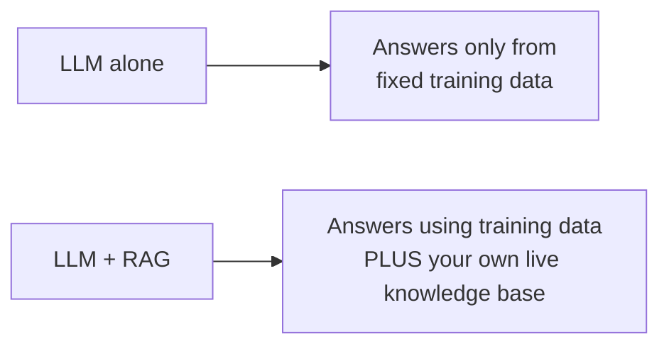
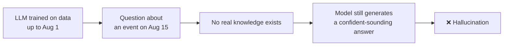
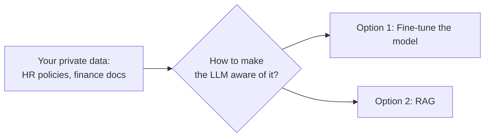
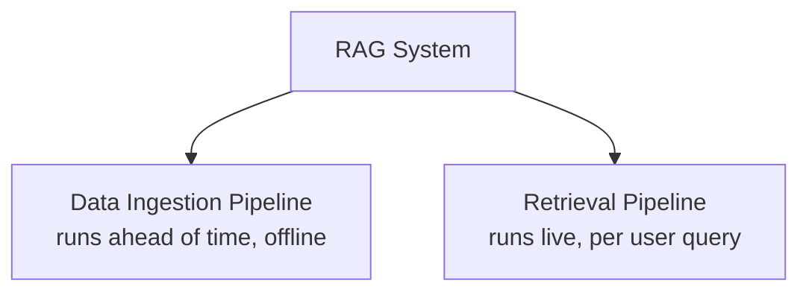
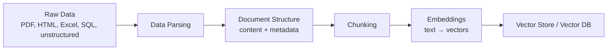
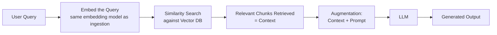
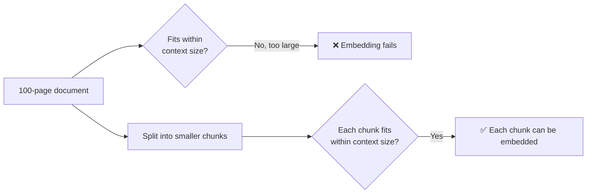
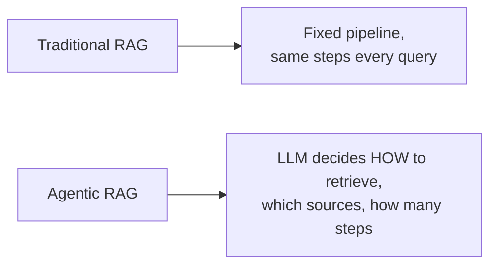

# RAG — Retrieval-Augmented Generation

RAG is the single most common pattern you'll actually build as a backend developer working with LLMs — roughly 90% of real production AI use cases at companies come down to some form of RAG. These notes cover what it is, exactly why it's needed, and the two pipelines that make it work.

## Contents

1. [What Is RAG?](#1-what-is-rag)
2. [Why RAG Is Needed — Two Core Problems With a Plain LLM](#2-why-rag-is-needed--two-core-problems-with-a-plain-llm)
3. [The Two Pipelines That Make Up RAG](#3-the-two-pipelines-that-make-up-rag)
4. [The Data Ingestion Pipeline, Step by Step](#4-the-data-ingestion-pipeline-step-by-step)
5. [The Retrieval Pipeline, Step by Step](#5-the-retrieval-pipeline-step-by-step)
6. [Why Chunking Exists](#6-why-chunking-exists)
7. [A Real-World Example — Perplexity](#7-a-real-world-example--perplexity)
8. [Traditional RAG vs. Agentic RAG](#8-traditional-rag-vs-agentic-rag)
9. [Seeing the Full Flow in Code](#9-seeing-the-full-flow-in-code)

---

## 1. What Is RAG?

**Definition:** RAG is the process of optimizing the output of a large language model by having it reference an authoritative knowledge base — one that sits outside its original training data — before generating a response.

An LLM is trained on a massive, but fixed, volume of data and uses that training to answer questions, translate text, and complete tasks. RAG extends that already-powerful capability to a specific domain or an organization's own internal knowledge base, without needing to retrain the model at all. This makes it a genuinely cost-effective way to make an LLM's output more relevant, accurate, and useful for a specific context.



---

## 2. Why RAG Is Needed — Two Core Problems With a Plain LLM

### 2.1 Problem One: Hallucination From a Fixed Training Cutoff

Every LLM is trained on data only up to a certain date. If a model was trained with data up to August 1st, and you ask it about something that happened on August 15th, it has no knowledge of that event at all.



The critical thing to understand about hallucination: the model doesn't refuse to answer just because it lacks the knowledge. It generates a plausible-sounding response anyway — because its underlying behavior is to always produce the most statistically likely continuation of text, not to admit uncertainty by default. It will confidently state something false, formatted exactly like a real answer, because avoiding a confident tone was never part of its incentive.

### 2.2 Problem Two: Private, Organization-Specific Data

Imagine running a startup with your own internal HR policies, finance policies, and other proprietary documents. This data was never publicly available on the internet, so no LLM's training data could have included it — yet you want a chatbot that can answer questions using exactly this information.



**Why fine-tuning is usually the wrong choice here:** fine-tuning means adjusting a model's billions of internal parameters directly — an expensive, slow, resource-heavy process. And since real organizational data (policies, documents) keeps changing over time, you'd need to repeat that expensive process every time something updates. That's simply not sustainable for data that changes regularly.

**This is exactly the gap RAG closes** — giving the LLM access to current, private, or specialized knowledge without ever touching its internal parameters.

---

## 3. The Two Pipelines That Make Up RAG

A working RAG system is built from two distinct pipelines that operate at different times:



- **Data Ingestion Pipeline** — prepares your own data (documents, policies, records) and stores it in a searchable form, before any user ever asks a question.
- **Retrieval Pipeline** — runs every time a user sends a query: retrieves the most relevant pieces of your prepared data and uses them to help the LLM generate an accurate answer.

---

## 4. The Data Ingestion Pipeline, Step by Step



- **Raw data** can be in any format at all — PDF, HTML, Excel, a SQL database, or fully unstructured text.
- **Data parsing** — reading that raw content and converting it into a usable structure. This step matters enormously; getting parsing right is a major part of what makes a RAG application actually work well later.
- **Document structure** — the parsed content gets organized into a document format, which typically includes both the actual **content** and **metadata** (information describing the content — its source, date, category, and similar attributes) about it.
- **Chunking** — the document gets split into smaller pieces (chunks) — covered in detail in Section 6, since the reasoning behind it matters.
- **Embeddings** — each chunk gets converted from text into a vector (a numerical representation), using an embedding model. Multiple providers offer embedding models — Google Gemini, OpenAI, Hugging Face, and various open-source options — each with different cost and performance trade-offs.
- **Vector store / vector database** — the final destination where all these embeddings are stored, ready to be searched later.

At the end of this pipeline, your organization's own data — the "knowledge base" that doesn't exist inside the LLM's training — is fully converted into a searchable set of vectors.

---

## 5. The Retrieval Pipeline, Step by Step



- **User query** — instead of going straight to the LLM, the query is first sent toward the vector database.
- **Embedding the query** — the same type of embedding model used during ingestion converts the user's question into a vector too, so it can be compared against the stored data.
- **Similarity search** — a technique (commonly cosine similarity) compares the query's vector against every stored chunk's vector, finding the ones that are closest in meaning.
- **Context** — whatever relevant chunks come back from that search are referred to as the "context" for this query.
- **Augmentation** — this context is combined with a prompt (an instruction telling the LLM how to use that context — e.g., "answer the question using only the information provided below").
- **Generation** — the LLM produces the final output, now grounded in real, retrieved information instead of relying purely on its own training data.

**This full sequence — retrieval, augmentation, generation — is exactly where the name "Retrieval-Augmented Generation" comes from.**

**Important honesty check:** RAG doesn't fully eliminate hallucination. If a user asks something genuinely unrelated to anything in the vector database, no relevant context will be found, and the LLM can still hallucinate on that specific question. What RAG does is dramatically reduce hallucination *for questions that are actually covered by your knowledge base* — which, in most real applications, is the vast majority of what users ask.

---

## 6. Why Chunking Exists

Every embedding model and every LLM has a fixed **context size** — a maximum amount of text it can process in one go. If you tried to feed an entire 100-page PDF directly into an embedding model in one piece, it would simply fail — the input would exceed what the model can handle.



Chunking solves this by splitting a document into smaller, manageable pieces — each one small enough to comfortably fit within the embedding model's context limit, and later, within the LLM's own context limit when that chunk is used as retrieved context. Getting the chunking strategy right (how big each chunk should be, where to split) has a direct effect on how accurate and relevant your retrieval results end up being later — this is a topic worth its own dedicated deep-dive (semantic chunking, overlap strategies, and similar techniques) once you're building a real system.

---

## 7. A Real-World Example — Perplexity

Perplexity is a genuinely useful example of RAG running in production. It works by connecting an LLM to multiple retrievers and tools — including live web search — then using an LLM to summarize and synthesize the retrieved information into a final answer. This is exactly the retrieval-then-generation pattern described above, just with the web itself acting as the knowledge base instead of a private, pre-built vector database.

---

## 8. Traditional RAG vs. Agentic RAG

Everything covered above describes **traditional RAG** — a fixed, linear pipeline: embed the query, retrieve context, augment the prompt, generate the answer, every single time, the same way.



**Agentic RAG** builds on this same foundation but adds decision-making — instead of always following one fixed retrieval path, an agent can decide whether retrieval is even needed, which knowledge sources to query, whether to search multiple times, and how to combine results from different sources before generating a final answer. This is a natural extension of the AI Agent / Agentic AI concepts covered earlier — the retrieval step itself becomes something the LLM reasons about, rather than something that always runs identically.

---

## 9. Seeing the Full Flow in Code

```javascript
import OpenAI from "openai";
import Anthropic from "@anthropic-ai/sdk";

const openai = new OpenAI({ apiKey: process.env.OPENAI_API_KEY });
const anthropic = new Anthropic({ apiKey: process.env.ANTHROPIC_API_KEY });

// --- Data Ingestion Pipeline (runs ahead of time, once per document) ---
async function ingestDocument(chunks) {
  for (const chunk of chunks) {
    const embed = await openai.embeddings.create({
      model: "text-embedding-3-small",
      input: chunk.text,
    });

    await db.query(
      `INSERT INTO knowledge_base (content, metadata, embedding) VALUES ($1, $2, $3)`,
      [chunk.text, JSON.stringify(chunk.metadata), JSON.stringify(embed.data[0].embedding)]
    );
  }
}

// --- Retrieval Pipeline (runs live, per user query) ---
async function answerWithRAG(userQuery) {
  // Step 1: embed the query using the same embedding model
  const queryEmbed = await openai.embeddings.create({
    model: "text-embedding-3-small",
    input: userQuery,
  });

  // Step 2: similarity search against the vector store
  const { rows } = await db.query(
    `SELECT content FROM knowledge_base ORDER BY embedding <-> $1 LIMIT 5`,
    [JSON.stringify(queryEmbed.data[0].embedding)]
  );

  // Step 3: build context from the retrieved chunks
  const context = rows.map(r => r.content).join("\n---\n");

  // Step 4: augmentation — combine context with the prompt, then generate
  const response = await anthropic.messages.create({
    model: "claude-sonnet-4-5",
    max_tokens: 400,
    system: `Answer the user's question using ONLY the context below. If the answer isn't in the context, say you don't have that information.\n\nContext:\n${context}`,
    messages: [{ role: "user", content: userQuery }],
  });

  return response.content[0].text;
}
```

Every line here maps directly to a labeled step in the diagrams above — `ingestDocument` is the entire Data Ingestion Pipeline, and `answerWithRAG` is the entire Retrieval Pipeline: embed → search → context → augment → generate.

---

## Summary

| Term | Meaning |
|---|---|
| RAG | Optimizing an LLM's output by referencing an external knowledge base before generating a response |
| Hallucination | The model confidently generating false information it has no real knowledge of |
| Data Ingestion Pipeline | Offline process: parse data → structure it → chunk it → embed it → store in a vector DB |
| Retrieval Pipeline | Live process: embed the query → similarity search → retrieve context → augment prompt → generate answer |
| Chunking | Splitting documents into smaller pieces to fit within a model's context size |
| Embedding | Converting text into a numerical vector representing its meaning |
| Context (in RAG) | The retrieved chunks relevant to the current query |
| Augmentation | Combining retrieved context with a prompt before sending it to the LLM |
| Agentic RAG | RAG where the LLM itself decides how, when, and from where to retrieve information |

**Next:** hands-on RAG implementation — document structure, metadata, and chunking strategies in detail.
