# AI for Software Developers

## Introduction

You already have solid software development fundamentals — you understand how systems talk to each other, how data moves through an application, how to debug something that isn't working, how to design something that scales. That foundation is not being replaced here. It is being built on.

AI, right now, is not a separate skill sitting apart from development — it's becoming part of what "development" means. A developer with strong fundamentals who adds AI on top of that is in a stronger position than someone starting AI from scratch with no engineering background at all, because most of what makes an AI feature actually work in production — clean input handling, sensible error handling, good system design, knowing when something is unreliable and needs a safety net — is exactly the fundamentals you already have.

These notes are written for that exact starting point: solid fundamentals, zero AI experience. Every topic gets a diagram to see the idea, a plain explanation to understand it, and real code to prove it works — nothing skipped, nothing assumed you already know, but nothing dumbed down either.

### Contents

1. [Artificial Intelligence — The Foundation](#1-artificial-intelligence--the-foundation)
2. [Machine Learning — The Core Shift](#2-machine-learning--the-core-shift)
3. [Deep Learning — When Data Gets Too Complex for Statistical ML](#3-deep-learning--when-data-gets-too-complex-for-statistical-ml)
4. [Generative AI](#4-generative-ai)
5. [Large Language Models (LLMs)](#5-large-language-models-llms)
6. [Workflows, AI Agents, and Agentic AI](#6-workflows-ai-agents-and-agentic-ai)
7. [Full Picture — Where Everything Sits](#7-full-picture--where-everything-sits)

Start here: what AI, Machine Learning, Deep Learning, Generative AI, and LLMs each mean, and how they fit inside one another.

---

## 1. Artificial Intelligence — The Foundation

**Definition:** Artificial Intelligence (AI) is a branch of computer science focused on building systems that can perform tasks that normally require human intelligence, such as learning from data, recognizing patterns, understanding language, making decisions, and solving problems.

**The point most people miss:** Machine Learning is an important subdomain of AI — but it is not the whole of AI. You can build a system that behaves intelligently, even at a human-comparable level for a specific task, using techniques that have nothing to do with learning from data at all.

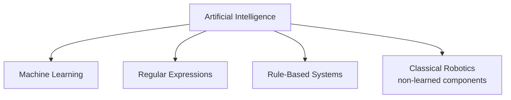

### 1.1 Regular Expressions — AI With Zero Machine Learning

A regular expression (regex) is a general computer science concept for matching patterns in text — and a system built entirely around regex matching can still count as "AI" if it performs a task well enough to look intelligent, even though nothing in it was ever trained on data.

```javascript
// A genuine AI-style task — detecting spam — solved with ZERO machine learning,
// using only regular expressions
function isSpamUsingRegex(emailText) {
  const spamPatterns = [
    /win\s+money/i,
    /free\s+prize/i,
    /urgent(ly)?\s+action\s+required/i,
    /claim\s+your\s+reward/i,
  ];

  return spamPatterns.some((pattern) => pattern.test(emailText));
}

console.log(isSpamUsingRegex("Win money now, click here!")); // true
console.log(isSpamUsingRegex("Here's the report you asked for")); // false
```

**Explaining this code, point by point:**

- **`const spamPatterns = [...]`** — a fixed list of text patterns a human decided were suspicious, written directly as regular expressions. No dataset was studied to arrive at these.
- **`/win\s+money/i`** — a regex pattern matching "win money" (any amount of whitespace between words, case-insensitive due to the `i` flag).
- **`spamPatterns.some((pattern) => pattern.test(emailText))`** — checks the email against every pattern, returning `true` the moment any one matches.
- **Why this counts as AI:** it performs a task — filtering spam — that would otherwise need a human reading the email. It behaves intelligently from the outside.
- **Why this is NOT Machine Learning:** nothing here was learned. Every pattern was chosen by a human. If a spammer rewrites their message to dodge every listed pattern, the system can't adapt on its own — a person has to notice and add a new rule.
- **The direct contrast to Machine Learning:** in Section 2's `spamModel.predict()` example, no human decided which phrases mean "spam" — the model discovered that from thousands of labeled examples. Here, a human decided every pattern in advance.

### 1.2 Where This Fits Before Machine Learning

Historically, most AI systems that existed before Machine Learning became practical were built exactly this way — rule-based logic, hand-written by programmers, with no learning involved:

- Chess engines
- Expert systems
- Regex-based text filters (like the spam example above)
- Certain robotics control logic

**The transition point:** these systems worked fine for simple, predictable problems, but broke down as problems got messier — spammers constantly rewording their messages, for instance, requiring an ever-growing list of hand-written rules that eventually becomes unmanageable. That exact breaking point is why researchers started asking: instead of writing more and more rules by hand, can the machine learn the rules itself from data? That question is where Machine Learning begins.

---

## 2. Machine Learning — The Core Shift

**Definition:** Machine Learning (ML) is a subset of Artificial Intelligence (AI) that enables computers to automatically learn patterns, relationships, and insights from data, and use that knowledge to make predictions, classifications, or decisions without being explicitly programmed with fixed rules for every situation.

### 2.1 The Fundamental Difference from Traditional Programming

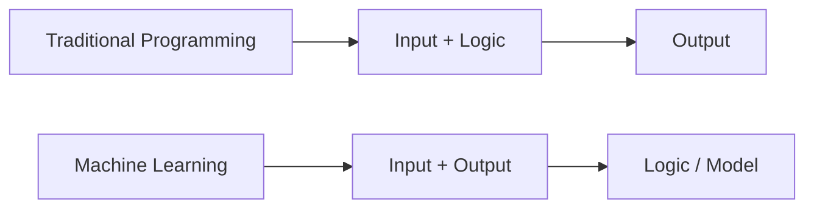

- **Traditional programming:** you give the computer the input *and* the logic (the rules/equation). It computes the output.
- **Machine Learning:** you give the computer the input *and* the output (real examples). The computer works out the logic itself. That discovered logic is saved as a **model**.

### 2.2 Training vs. Inference — The Two Phases of ML

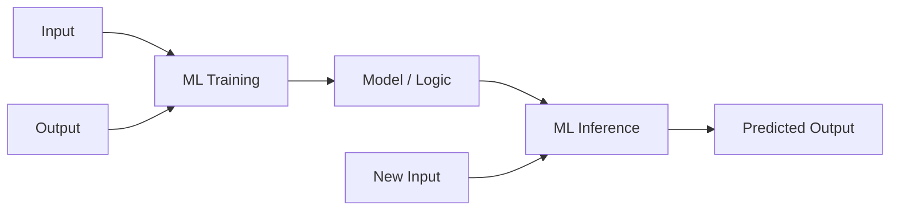

| Phase | What happens |
|---|---|
| **Training** | You feed the system many input-output examples. It studies them and derives the underlying logic/pattern, saved as a "model." |
| **Inference** | You give the trained model a brand-new input it has never seen. It applies the learned logic and produces a predicted output. |

```javascript
// Traditional programming — you write the logic yourself
function isSpamOldWay(email) {
  if (email.includes("Win Money") || email.includes("Free Prize")) {
    return true;
  }
  return false;
}

// Machine Learning — you give input+output examples during training,
// the model derives the logic itself, then you call it at inference time
const trainingData = [
  { email: "Limited offer, win money now!", label: "spam" },
  { email: "Meeting notes attached", label: "not_spam" },
  // ...thousands more labeled examples
];

// await spamModel.train(trainingData);  // training phase — happens once, offline

const newEmail = "Congratulations, you've been selected for a reward!";
const prediction = await spamModel.predict({ email: newEmail }); // inference phase
console.log(prediction); // { label: "spam", confidence: 0.94 }
```

### 2.3 The Two Major Categories of ML Tasks

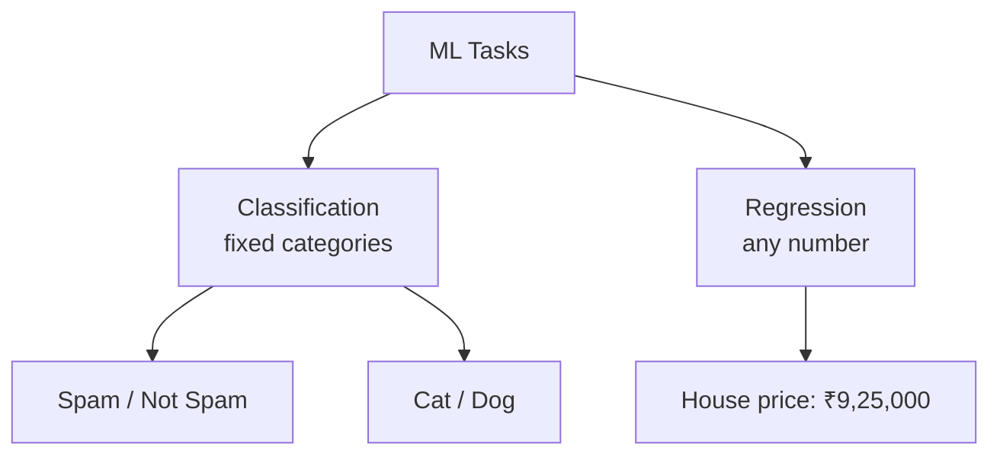

**A. Classification** — mapping an input to one of a fixed set of categories (spam/not spam, cat/dog, business/sports/tech/health).

**B. Regression** — predicting a number, with no fixed set of possible answers (e.g., predicting a home's price from bedrooms, area, and age).

```javascript
// Classification — output is one of a fixed set of labels
const emailResult = await classifierModel.predict({ email: newEmail });
console.log(emailResult); // { label: "spam" } — always one of: spam / not_spam

// Regression — output is a number, with no fixed set of possible values
const priceResult = await priceModel.predict({ bedrooms: 3, areaSqft: 1400, ageYears: 5 });
console.log(priceResult); // { predictedPrice: 9250000 } — could be any number
```

### 2.4 Supervised vs. Unsupervised Learning

The input-output pairs used in training are also called **labeled data** — mathematically, input is X and output is Y.

| Type | Definition | Example |
|---|---|---|
| **Supervised Learning** | Trained on labeled data (X-Y pairs) | Emails already tagged spam/not spam |
| **Unsupervised Learning** | Trained on unlabeled data — finds its own groupings | Grouping documents into folders with no categories given in advance |

**Analogy:** a child told "put dolls here, cars there" is supervised — categories given. A child told "just sort these into two groups, however you like" is unsupervised — the pattern is discovered, not assigned.

**Real industry use cases:**
- **Clustering** — grouping similar documents (legal docs, invoices) with no pre-labeling. Algorithms: K-Means, DBSCAN, Hierarchical Clustering.
- **Outlier detection** — flagging data points that fit no cluster (e.g., anomalies in financial earnings estimates).
- Common supervised algorithms: Linear Regression, Logistic Regression, Decision Trees, Random Forest, XGBoost.

```javascript
// Supervised learning — you provide labeled examples (X-Y pairs)
const labeledEmails = [
  { text: "Win money now!", label: "spam" },
  { text: "Project update attached", label: "not_spam" },
];
// await spamModel.train(labeledEmails); — model learns to map X (text) to Y (label)

// Unsupervised learning — you provide data with NO labels at all
const documents = [
  { text: "Invoice #1042, due 30 days" },
  { text: "Non-disclosure agreement, effective date..." },
  { text: "Invoice #1043, due 30 days" },
];
const clusters = await clusteringModel.fit(documents);
console.log(clusters);
// { cluster_1: ["Invoice #1042...", "Invoice #1043..."], cluster_2: ["Non-disclosure..."] }
```

### 2.5 Common Statistical ML Tooling

Python (language), Pandas/NumPy (data handling), Matplotlib/Seaborn (visualization), Jupyter Notebook (development), Scikit-learn/XGBoost (model training).

---

## 3. Deep Learning — When Data Gets Too Complex for Statistical ML

### 3.1 Structured vs. Unstructured Data

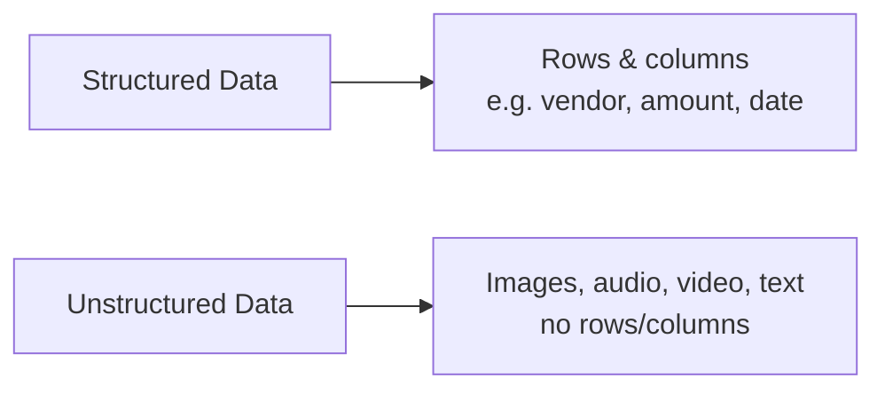

Statistical ML (Decision Trees, XGBoost) works well on structured, tabular data but struggles on unstructured data — a photo is just a grid of pixel values with no natural "columns." This gap is what Deep Learning was built to close.

### 3.2 How a Neural Network "Sees"

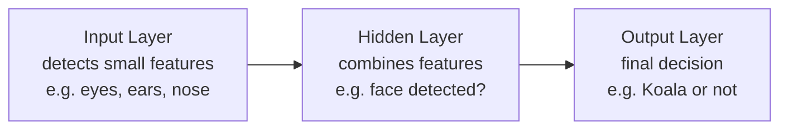

- Each input neuron detects one small feature, giving a confidence score (0 to 1).
- A hidden layer combines feature scores into a higher-level judgment.
- The output layer makes the final call.
- **Training via backward error propagation:** the network guesses, gets told right/wrong, and the error signal flows backward through every layer so each part adjusts — repeated over thousands of examples.

**Definition:** Deep Learning is a Machine Learning technique that uses neural networks to learn from large amounts of data, loosely mimicking the brain's pattern-recognition ability — usually needing far more training data than statistical ML.

```javascript
// You call an already-trained Deep Learning model, same shape as any other model call
const result = await imageModel.classify({ imageUrl: "https://example.com/koala.jpg" });
console.log(result); // { label: "koala", confidence: 0.91 }
// The calling pattern is identical to the statistical ML calls above —
// what changed is what's INSIDE the model, not how you interact with it.
```

### 3.3 Choosing Statistical ML vs. Deep Learning

| Criteria | Favor Statistical ML | Favor Deep Learning |
|---|---|---|
| Feature complexity | Simple, structured | Complex (images, video, audio) |
| Data type | Tabular | Unstructured |
| Data volume | Smaller datasets | Usually large volumes |

Guidelines, not hard rules — testing both approaches is normal.

### 3.4 Core Neural Network Architectures

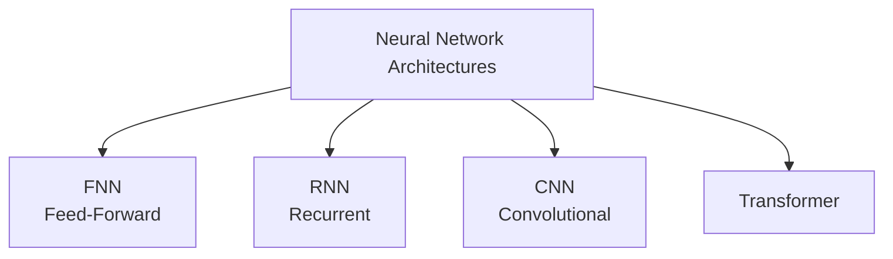

**FNN (Feed-Forward Neural Network)**

The simplest architecture — data flows in one direction only, from input to hidden layers to output, with no loops and no memory of previous inputs. Like a juicer: fruit goes in one end, juice comes out the other, and the juicer has no idea what fruit went through it a moment ago.

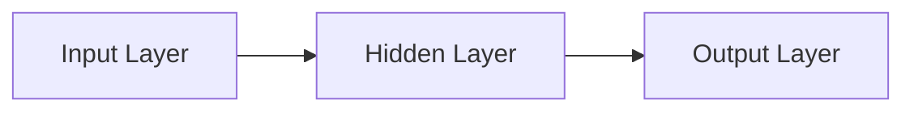

Best suited for straightforward, structured problems where each input is independent of the ones before it — no sequence or spatial structure to preserve.

**RNN (Recurrent Neural Network)**

Designed for sequences — text, time-series data, anything where order matters. It processes one element at a time, feeding its own previous output back in as additional context for the next step. Like adjusting a soup recipe as you go: taste it, add something, taste again, adjust again — each step depends on what happened in the step before.

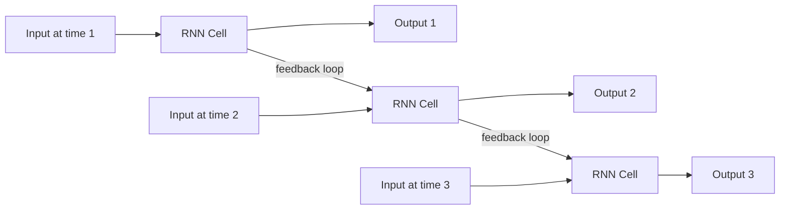

The weakness: RNNs process one token at a time, in sequence — slow, and prone to "forgetting" context from early in a long sequence by the time they reach the end. This exact limitation is what motivated the Transformer architecture later.

**CNN (Convolutional Neural Network)**

Designed specifically for images and other grid-like data (like spectrograms of audio). Instead of looking at an entire image at once, a CNN slides a small filter (a "kernel") across small patches of the image, detecting simple local features first — edges, corners, color gradients.

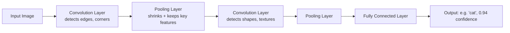

- **Convolution layers** scan the image with small filters, each one learning to detect a specific simple pattern (a vertical edge, a curve, a patch of color).
- **Pooling layers** shrink the data down between convolution steps, keeping the strongest signals and discarding redundant detail — this also makes the network tolerant of an object appearing in a slightly different position or scale in the image.
- Early layers detect simple features (edges); deeper layers combine those into more complex ones (an eye, an ear); the final layers combine everything into a full classification (a face, a cat, a stop sign).

This layered "simple-features-first, complex-features-later" structure is exactly why CNNs became the standard architecture for image classification, object detection, and facial recognition — it mirrors how a Deep Learning network in general builds understanding in layers, but with a structure specifically tuned to exploit the 2D spatial patterns in images rather than the sequential patterns in text.

**Transformer**

The architecture behind essentially all modern Generative AI and Agentic AI. Unlike an RNN, it doesn't process tokens one at a time — it looks at an entire sequence at once and uses **self-attention** to figure out which words are most relevant to which other words, regardless of their distance apart in the sequence.

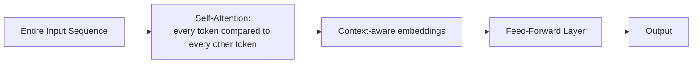

GPT stands for **Generative Pre-trained Transformer** — this architecture is the direct reason modern LLMs can maintain context across long passages far better than RNNs ever could, and process input in parallel rather than one token at a time, making both training and inference dramatically faster at scale.

> 📖 **For more information:** see [Transformer.md](https://github.com/shaktikadam1630/AI-For-Backend-Developers/blob/main/Transformer.md)

**Quick comparison:**

| Architecture | Best suited for | Processes input |
|---|---|---|
| FNN | Simple, structured, independent inputs | All at once, no memory |
| RNN | Sequences (text, time-series) | One step at a time, with memory of previous steps |
| CNN | Images, grid-like/spatial data | In small local patches, layer by layer |
| Transformer | Sequences (text, and increasingly images/audio too) | Entire sequence at once, via attention |

---

### 3.5 Deep Learning Tooling

PyTorch (Meta, more popular/beginner-friendly) and TensorFlow (Google, more fine-grained control). GPUs are essentially required for training at scale — local or rented in the cloud.

## 4. Generative AI

**Definition:** the category of AI where the objective is to generate new content — text, images, audio, video, or code — rather than predicting, classifying, or detecting something about existing input.

| Aspect | Traditional AI | Generative AI |
|---|---|---|
| Purpose | Analyze, predict, classify, decide | Generate new content |
| Output type | Labels, yes/no, numbers | Creative — paragraphs, images, audio |
| Model types | Decision Trees, Linear Regression, SVM | LLMs, GANs, Diffusion Models |
| Training approach | Supervised learning on labeled data | Pre-training on massive datasets |
| Human-like capability | Limited | High — e.g., writing poetry |
| Common tooling | XGBoost, Scikit-learn | LLM-based tools/APIs |

**Important nuance:** Generative AI didn't replace traditional AI — spam classification, image classification, and price prediction still run on traditional/Deep Learning models because they're lightweight and well-suited to those specific tasks.

```javascript
// Traditional AI — output is a label/number, from a fixed set of possibilities
const spamResult = await spamModel.classify({ email: emailText });
console.log(spamResult); // { label: "not_spam" }

// Generative AI — output is brand new content, not picked from a fixed set
import Anthropic from "@anthropic-ai/sdk";
const anthropic = new Anthropic({ apiKey: process.env.ANTHROPIC_API_KEY });

const poem = await anthropic.messages.create({
  model: "claude-sonnet-4-5",
  max_tokens: 150,
  messages: [{ role: "user", content: "Write a short poem about samosas." }],
});
console.log(poem.content[0].text); // newly generated text, different every run
```

**Examples by content type:** Text (GPT, Llama, Gemini, Claude) · Image (DALL-E, Stable Diffusion) · Audio (AudioGen, MusicLM) · Video (Sora)

---

## 5. Large Language Models (LLMs)

### 5.1 The "Stochastic Parrot" Analogy

A pet parrot (Buddy) who's heard every conversation in the house can mimic speech well — hearing "I'm feeling hungry," he's far more likely to say "food" next than "bicycle," purely from statistical pattern-matching, with zero real understanding of meaning.

An LLM works the same way, at massive scale — trained on huge volumes of text (Wikipedia, books, news) with billions/trillions of internal parameters, capturing far more complex language patterns than a small model trained on one narrow dataset (like the one powering Gmail autocomplete).

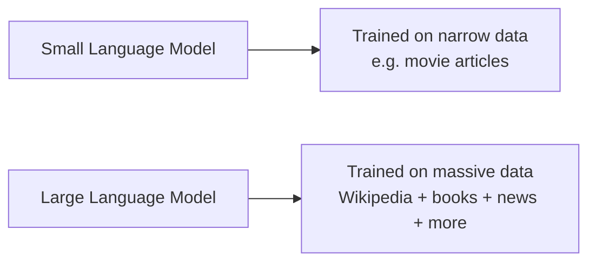
 > 📖 **For more information:** see [LLM-Fundamentals.md](https://github.com/shaktikadam1630/AI-For-Backend-Developers/blob/main/LLM-Fundamentals.md)
### 5.2 RLHF — Reinforcement Learning with Human Feedback

If Buddy picked up toxic language, his owner would need to actively correct him — showing multiple possible responses and marking which are acceptable. This is exactly how LLMs like ChatGPT are made safer: human reviewers rank multiple model responses, and the model is further trained on that feedback.

```javascript
// A basic LLM call — shaped by both original training AND RLHF alignment
const response = await anthropic.messages.create({
  model: "claude-sonnet-4-5",
  max_tokens: 100,
  messages: [{ role: "user", content: "I'm feeling hungry, what should I eat?" }],
});
console.log(response.content[0].text);
// Response is helpful and safe — a direct result of RLHF shaping the raw
// statistical prediction the base model would otherwise produce
```

---

## 6. Workflows, AI Agents, and Agentic AI

Three levels of complexity, in order:

### 6.1 Level 1 — A Simple RAG Chatbot (Workflow)

Answers policy questions by looking up private documents using **Retrieval-Augmented Generation (RAG)**. Reactive only — no actions taken.

### 6.2 Level 2 — A Tool-Augmented Chatbot (Still a Workflow)

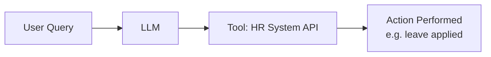

Connected to real APIs — can check/apply leave. Still one simple task per request, no broader autonomy.

### 6.3 Level 3 — A True Agentic System

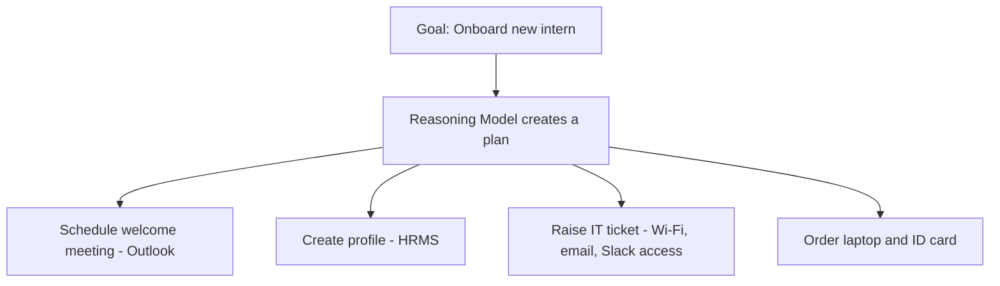

Given only a goal ("onboard the new intern"), the system plans and executes multi-step actions itself, with no step-by-step instructions.

**Characteristics:** goal-oriented planning · multi-step reasoning · autonomous decision-making · access to tools, knowledge, and memory.

```javascript
// Level 1 — Simple RAG chatbot: reactive, no actions
const ragAnswer = await anthropic.messages.create({
  model: "claude-sonnet-4-5",
  max_tokens: 200,
  system: `Answer using only this policy doc:\n${policyDocText}`,
  messages: [{ role: "user", content: "How many sick leave days do I get?" }],
});

// Level 2 — Tool-augmented chatbot: one action, still simple
const tools = [{
  name: "applyLeave",
  description: "Apply for leave on behalf of the logged-in employee",
  input_schema: { type: "object", properties: { days: { type: "number" } }, required: ["days"] },
}];
const toolResponse = await anthropic.messages.create({
  model: "claude-sonnet-4-5",
  max_tokens: 200,
  tools,
  messages: [{ role: "user", content: "Apply for 2 days of leave for me." }],
});
// Your code executes toolResponse's tool_use block against the real HR API

// Level 3 — Agentic system: goal given, multi-step plan executed autonomously
async function onboardIntern(internName, startDate) {
  const plan = await anthropic.messages.create({
    model: "claude-sonnet-4-5",
    max_tokens: 500,
    tools: [scheduleTool, hrmsTool, itTicketTool, orderEquipmentTool],
    messages: [{ role: "user", content: `Onboard ${internName}, starting ${startDate}.` }],
  });
  // The model reasons through the goal, calling multiple tools in sequence:
  // scheduleTool -> hrmsTool -> itTicketTool -> orderEquipmentTool
  // Your code executes each requested tool call and feeds results back until done
}
```

### 6.4 Defining the Three Related Terms Precisely

| Term | Definition |
|---|---|
| **AI Agent** | A component that perceives its environment, decides, and acts to reach a goal — powered by an LLM. |
| **Agentic AI** | A system with one or more agents, capable of complex multi-step reasoning and autonomous action. |
| **Generative AI** | The content-generation capability, often used *inside* an agent — not the same as the agent itself. |

**Autonomy**, precisely: the freedom to take an action on its own — like sending an email or creating a ticket — without confirmation at every step.

### 6.5 Generative AI vs. Agentic AI

| Aspect | Generative AI | Agentic AI |
|---|---|---|
| Purpose | Create new content | Reason, plan, act toward a goal |
| Output | Unstructured content | Actions performed in the real system |
| Autonomy | Very little — waits for each prompt | High — plans and acts with minimal instruction |
| Planning | Minimal | Multi-step, detailed |
| Tool usage | Minimal | Heavy |
| Behavior | Reactive | Proactive |

**Rule of thumb:** ChatGPT answering one question = Generative AI. ChatGPT performing multi-step deep research, browsing and synthesizing autonomously = Agentic AI.

### 6.6 Common Tooling

Code-based: Agno, Google's Agent Development Kit, OpenAI's agent toolkit. No-code/low-code: n8n, Zapier.

---

## 7. Full Picture — Where Everything Sits

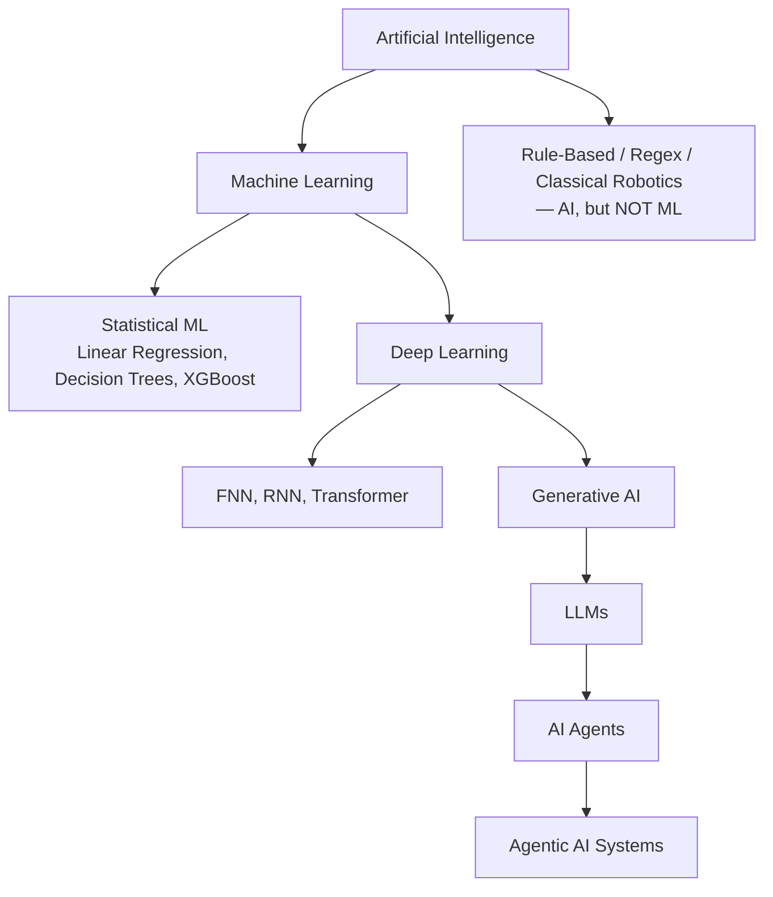

**The rule to walk away with:** every layer is fully contained inside the layer above it — Generative AI sits inside Deep Learning, Deep Learning sits inside Machine Learning, and Machine Learning sits inside AI. But AI itself is bigger than Machine Learning — regex, rule-based systems, and classical robotics are all genuine AI that never learned from a single data point.

**Coming next:** supervised learning algorithms individually — Linear Regression, Logistic Regression, Decision Trees — with real code.
