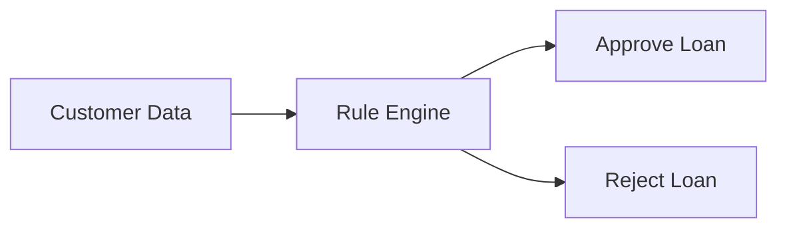
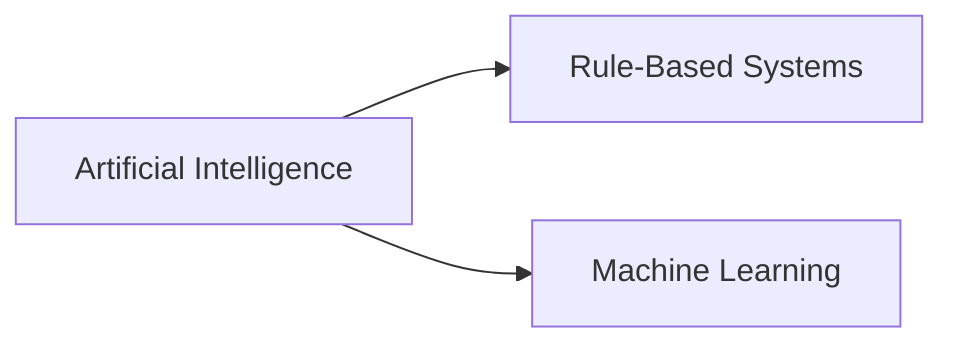
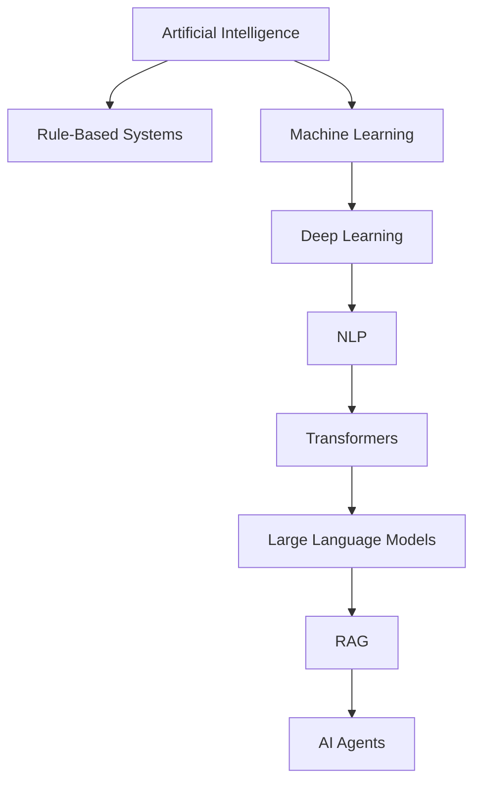
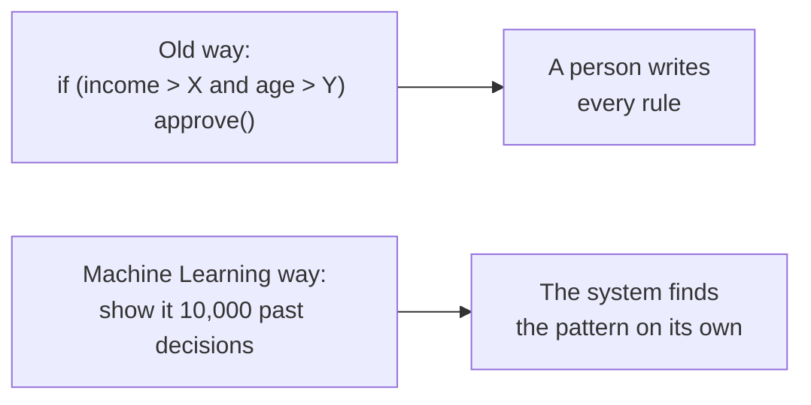
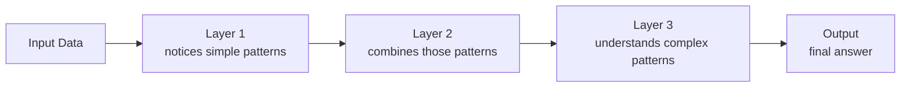
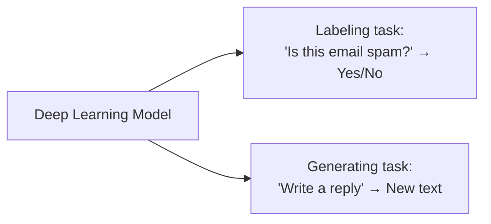
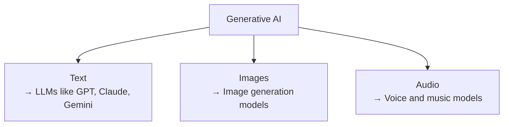

# AI for Software Developers

## Introduction

You already know how to build software — you understand code, logic, data, and systems. What you're starting now is AI: a new layer of knowledge that sits on top of the skills you already have, not a replacement for them.

The problem is that "AI," "Machine Learning," and "LLM" get used like they're interchangeable — they're not, and that confusion is where most self-taught understanding of AI breaks down later. These notes exist to fix that, one concept at a time, written specifically for someone who already thinks like a developer.

No Python, no math degree, no data science background required. Each topic comes with a diagram, a plain-language explanation, and working code, built up in an order where nothing depends on something you haven't read yet.

We start at the foundation: what does "AI" actually mean, and how do Machine Learning, Deep Learning, Generative AI, and LLMs all fit inside it?

---

# 1. Artificial Intelligence (AI)

Artificial Intelligence (AI) is the broad field of building machines that can perform tasks which normally require human intelligence.

The important thing to understand is:

> AI does NOT automatically mean Machine Learning, Neural Networks, or ChatGPT.

A system can be considered AI even if it follows fixed rules written by a programmer. If a machine can make decisions, solve problems, or behave in a way that appears intelligent, it falls under the umbrella of AI.

---

## Think Like a Software Developer

Imagine you are building a banking system. A customer applies for a loan. A human employee checks:

- Salary
- Credit Score
- Existing Loans
- Age

Then decides: **Approve Loan** or **Reject Loan**.

Instead of a human doing this, we can write rules inside software.



The machine is making decisions. This is Artificial Intelligence.

---

## AI Before Machine Learning

Before Machine Learning became popular, most AI systems were rule-based systems. The developer manually wrote every rule.



Examples: Chess Programs, Expert Systems, Medical Diagnosis Systems, Loan Approval Systems.

None of these systems learned anything. They simply followed rules.

---

## Example: Rule-Based Loan Approval

```javascript
function approveLoan(salary, creditScore, hasExistingLoan) {

    if (
        salary > 50000 &&
        creditScore > 700 &&
        !hasExistingLoan
    ) {
        return "Approved";
    }

    return "Rejected";
}
```

### Code Explained, Point by Point

- **`function approveLoan(salary, creditScore, hasExistingLoan) {`** — takes three pieces of information about a customer: income, credit score, and whether they already have another loan.
- **`salary > 50000`** — Rule 1. The customer must earn more than ₹50,000. This number was chosen by a person, not calculated from data.
- **`creditScore > 700`** — Rule 2. The customer must have a credit score above 700 — again, a threshold picked by a human, not discovered from past cases.
- **`!hasExistingLoan`** — Rule 3. The `!` means "not." This checks the customer does *not* already have an active loan.
- **`&&`** joins all three conditions — every single one must be true for the loan to be approved.
- **`return "Approved";`** — if all three rules pass, this fixed outcome is returned.
- **`return "Rejected";`** — the fallback if even one rule fails. No in-between, no judgment call — just a binary outcome the programmer defined in advance.

**Example call:**

```javascript
approveLoan(60000, 750, false);
// salary: 60000 > 50000 → true
// creditScore: 750 > 700 → true
// hasExistingLoan: false, so !false → true
// All three true → returns "Approved"
```

---

## Why This Is AI

The system is making decisions that normally require a human employee. A person watching the software would say:

> "The computer is intelligently deciding who gets a loan."

But notice:
- No learning
- No training
- No data analysis
- No pattern recognition

Everything comes from rules written by the programmer.

---

## Limitations of Rule-Based AI

Imagine handling spam emails. You write:

```javascript
if (email.includes("Win Money")) {
    return "Spam";
}
```

Spammers change their message:

```text
Congratulations!
You Won A Reward
```

Now your rule fails. You add another rule:

```javascript
if (email.includes("Reward")) {
    return "Spam";
}
```

Then they change it again. You keep writing more and more rules:

```text
Rule 1
Rule 2
Rule 3
Rule 50
Rule 500
Rule 5000
```

This quickly becomes impossible to maintain.

---

## The Problem AI Researchers Faced

Rule-based systems work well when:
- The rules are simple
- The problem is predictable

They fail when:
- Patterns constantly change
- Data becomes huge
- Rules become too complex

Researchers started asking:

> Instead of writing rules ourselves, can a machine learn the rules automatically from data?

That question led to the birth of **Machine Learning** — the next major branch inside AI.

---

## AI Hierarchy



---

## Key Takeaways

- AI is the broad field of making machines behave intelligently.
- AI does not necessarily require learning.
- Rule-based systems are valid AI systems.
- Traditional AI relies on human-written rules.
- Rule-based systems become difficult to scale.
- Machine Learning was created to allow machines to learn rules from data instead of manually programming them.
- Machine Learning is a subset of Artificial Intelligence.

---

### 2. Machine Learning (ML)

This is where real "learning" begins. Instead of a person writing the rules, the system looks at data and works out the pattern itself.



| Type | In plain words | Example |
|---|---|---|
| Supervised Learning | Learns from examples that already have the correct answer attached | An email already marked "spam" or "not spam" |
| Unsupervised Learning | Finds patterns in data with no answers given at all | Grouping customers by similar buying habits |
| Reinforcement Learning | Learns by trying things and getting rewarded or punished | A system earning points for good moves in a game |

```javascript
// Old way — a person writes every rule by hand
function approveLoanOldWay(income, age) {
  if (income > 50000 && age > 21) return "approved";
  return "rejected";
}

// Machine Learning way — the system learned this decision from past data
// (you don't write the rule; a trained model produces the decision)
const decision = await loanModel.predict({ income: 62000, age: 27 });
console.log(decision); // e.g. "approved" — based on patterns learned from 10,000 past cases
```

---

### 3. Deep Learning (DL)

Regular Machine Learning struggles with complex data — photos, audio, long text. Deep Learning was built to handle exactly that, using a **neural network**: many small units stacked in layers, each layer building on what the layer before it noticed.



"Deep" simply means many layers stacked together.

Two neural network types worth knowing:
- **CNN (Convolutional Neural Network)** — built for images, scans small parts of a picture and builds up the full understanding.
- **RNN (Recurrent Neural Network)** — built for text, reads word by word trying to remember what came before, but often forgets the start of a long sentence by the time it reaches the end. This weakness led to the Transformer, the design behind every modern LLM.

```javascript
// You don't build a neural network yourself — you call a model that already has one
// Example: an image classifier built on a CNN, accessed via an API
const result = await visionModel.classify({ imageUrl: "https://example.com/photo.jpg" });
console.log(result); // { label: "cat", confidence: 0.97 }
```

---

### 4. Generative AI

Not every Deep Learning model creates something new — some just label things that already exist.



A spam filter picks a label. A tool that writes a full reply email creates something brand new. That's Generative AI — the layer where the model *makes* something instead of just sorting it.

```javascript
// Classification (Deep Learning, NOT Generative AI) — outputs a label
const spamCheck = await spamModel.classify({ email: emailText });
console.log(spamCheck); // { label: "not_spam" }

// Generation (Generative AI) — outputs brand new text
const reply = await anthropic.messages.create({
  model: "claude-sonnet-4-5",
  max_tokens: 150,
  messages: [{ role: "user", content: "Write a polite reply declining this meeting request." }],
});
console.log(reply.content[0].text); // newly generated text, not a label
```

---

### 5. Large Language Models (LLMs)

LLMs are Generative AI's language specialist — trained on huge amounts of text, built to understand and produce human language.



This is the layer you'll actually work with most going forward.

```javascript
import Anthropic from "@anthropic-ai/sdk";
const anthropic = new Anthropic({ apiKey: process.env.ANTHROPIC_API_KEY });

const response = await anthropic.messages.create({
  model: "claude-sonnet-4-5",
  max_tokens: 100,
  messages: [{ role: "user", content: "What is an LLM, in one sentence?" }],
});

console.log(response.content[0].text);
```

---

## Putting It All Together

| Real Example | Where It Sits |
|---|---|
| A 1990s chess program with fixed rules | AI only |
| A spam filter trained on labeled emails | AI → ML |
| Face recognition on your phone | AI → ML → Deep Learning |
| A tool that writes marketing text | AI → ML → Deep Learning → Generative AI → LLM |
| ChatGPT, Claude, Gemini | AI → ML → Deep Learning → Generative AI → LLM |

**One line to remember:** every LLM is Generative AI, every Generative AI model is Deep Learning, every Deep Learning model is Machine Learning, every Machine Learning system is AI — and it never runs backward.

---

**Coming next:** Types of Machine Learning, in more depth.
