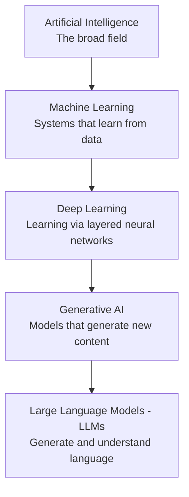
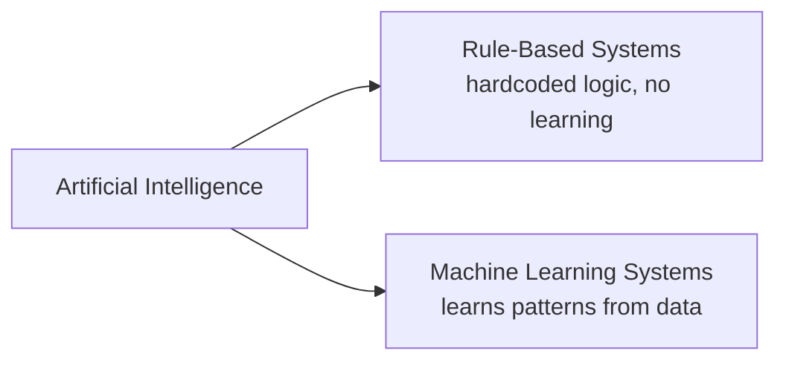
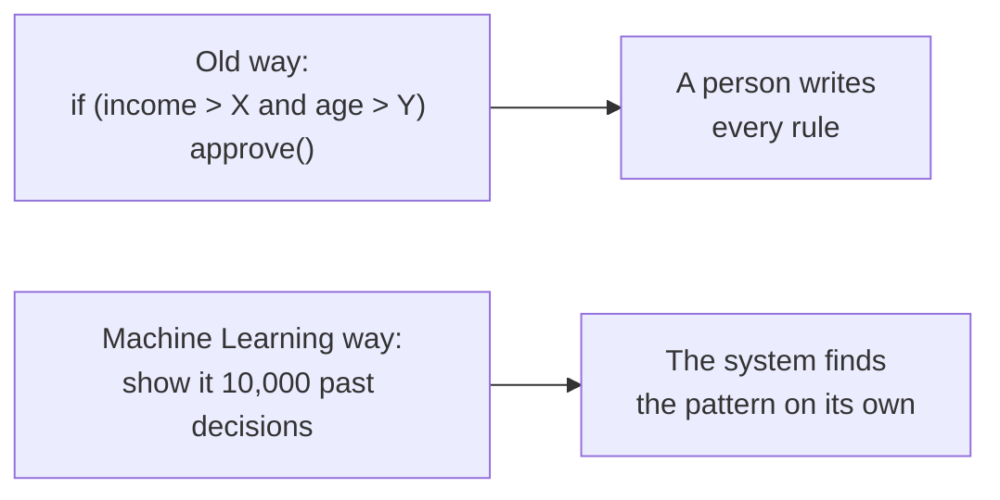

# AI for Software Developers

## Introduction

You already know how to build software — you understand code, logic, data, and systems. What you're starting now is AI: a new layer of knowledge that sits on top of the skills you already have, not a replacement for them.

The problem is that "AI," "Machine Learning," and "LLM" get used like they're interchangeable — they're not, and that confusion is where most self-taught understanding of AI breaks down later. These notes exist to fix that, one concept at a time, written specifically for someone who already thinks like a developer.

No Python, no math degree, no data science background required. Each topic comes with a diagram, a plain-language explanation, and working code, built up in an order where nothing depends on something you haven't read yet.

We start at the foundation: what does "AI" actually mean, and how do Machine Learning, Deep Learning, Generative AI, and LLMs all fit inside it?

---

## The AI Hierarchy

"AI," "Machine Learning," and "LLM" are not the same thing. They are five layers, nested one inside the other — like boxes inside boxes.



**The rule:** every layer sits inside the layer above it.
- Every LLM is Generative AI
- Every Generative AI model is Deep Learning
- Every Deep Learning model is Machine Learning
- Every Machine Learning system is AI

It never works the other way around.

---

### 1. Artificial Intelligence (AI)

AI is the biggest box. It means: **a machine behaving in a way that looks intelligent.**

It doesn't need to "learn" anything. A 1990s chess program running fixed rules (`if the opponent moves here, respond like this`) still counts as AI — no data, no learning, just smart-looking rules written by a person.



The term "AI" goes back to 1956 — decades before anything like ChatGPT existed.

```javascript
// This is genuine AI — no learning, no data, just rules. It still "behaves" intelligently.
function chessMove(opponentMove) {
  if (opponentMove === "e4") return "e5";
  if (opponentMove === "d4") return "d5";
  return "knightToF3"; // a fixed, hardcoded response for every case
}
```

---

### 2. Machine Learning (ML)

This is where real "learning" begins. Instead of a person writing the rules, the system looks at data and works out the pattern itself.



| Type | In plain words | Example |
|---|---|---|
| Supervised Learning | Learns from examples that already have the correct answer attached | An email already marked "spam"
