## Introduction

You already have solid software development fundamentals — you understand how systems talk to each other, how data moves through an application, how to debug something that isn't working, how to design something that scales. That foundation is not being replaced here. It is being built on.

AI, right now, is not a separate skill sitting apart from development — it's becoming part of what "development" means. A developer with strong fundamentals who adds AI on top of that is in a stronger position than someone starting AI from scratch with no engineering background at all, because most of what makes an AI feature actually work in production — clean input handling, sensible error handling, good system design, knowing when something is unreliable and needs a safety net — is exactly the fundamentals you already have.

These notes are written for that exact starting point: solid fundamentals, zero AI experience. Every topic gets a diagram to see the idea, a plain explanation to understand it, and real code to prove it works — nothing skipped, nothing assumed you already know, but nothing dumbed down either.

Start here: **The AI Hierarchy** — what AI, Machine Learning, Deep Learning, Generative AI, and LLMs each mean, and how they fit inside one another.

# AI Concepts — Machine Learning to Agentic AI

## 0. Artificial Intelligence — The Foundation Before Machine Learning

**Definition:** AI is the overarching field in computer science where computers are trained to perform tasks that humans are generally good at — recognizing patterns, visual understanding, voice or text understanding, and similar tasks.

**The point most people miss:** Machine Learning is an important subdomain of AI — but it is not the whole of AI. You can build a system that behaves intelligently, even at a human-comparable level for a specific task, using techniques that have nothing to do with learning from data at all.

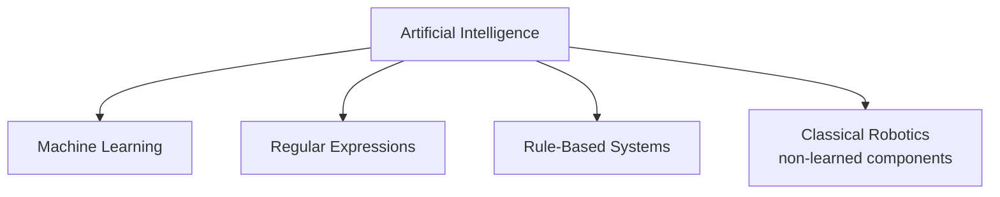

### Regular Expressions — AI With Zero Machine Learning

A regular expression (regex) is a general computer science concept for matching patterns in text — and a system built entirely around regex matching can still count as "AI" if it performs a task well enough to look intelligent, even though nothing in it was ever trained on data.

```javascript
// A genuine AI-style task — detecting spam — solved with ZERO machine learning,
// using only regular expressions
function isSpamUsingRegex(emailText) {
  const spamPatterns = [
    /win\s+money/i,
    /free\s+prize/i,
    /urgent(ly)?\s+action\s+required/i,
    /claim\s+your\s+reward/i,
  ];

  return spamPatterns.some((pattern) => pattern.test(emailText));
}

console.log(isSpamUsingRegex("Win money now, click here!")); // true
console.log(isSpamUsingRegex("Here's the report you asked for")); // false
```

**Explaining this code, point by point:**

- **`const spamPatterns = [...]`** — a fixed list of text patterns a human decided were suspicious, written directly as regular expressions. No dataset was studied to arrive at these — a person simply thought "spam emails often contain these phrases."
- **`/win\s+money/i`** — a regex pattern matching "win money" (with any amount of whitespace between the words, and case-insensitive due to the `i` flag). This single line replaces what would otherwise need many `if` statements.
- **`spamPatterns.some((pattern) => pattern.test(emailText))`** — checks the email text against every pattern in the list, returning `true` the moment any one of them matches.
- **Why this counts as AI:** it performs a task — filtering spam — that would otherwise need a human reading the email. It behaves intelligently from the outside.
- **Why this is NOT Machine Learning:** nothing here was learned. Every pattern was chosen by a human, exactly the same way the loan-approval `if` statements in Topic 1's earlier notes were chosen by a human. If a spammer rewrites their message to dodge every pattern on this list, the system has no way to adapt on its own — a person has to notice the failure and manually add a new pattern.
- **The direct contrast to Machine Learning:** in the `spamModel.predict()` examples from Section 1, no human decided which phrases mean "spam" — the model discovered that from thousands of labeled examples. Here, a human decided every single pattern in advance.

### Where This Fits Before Machine Learning

Historically, most AI systems that existed before Machine Learning became practical were built exactly this way — rule-based logic, hand-written by programmers, with no learning involved:

- Chess engines
- Expert systems
- Regex-based text filters (like the spam example above)
- Certain robotics control logic

**The transition point:** these systems worked fine for simple, predictable problems, but broke down as problems got messier — spammers constantly rewording their messages, for instance, requiring an ever-growing list of hand-written rules that eventually becomes unmanageable. That exact breaking point is why researchers started asking: instead of writing more and more rules by hand, can the machine learn the rules itself from data? That question is where Machine Learning begins — covered next.

---

## 1. Machine Learning — The Core Shift

**Definition:** ML is the process of teaching computers to learn patterns from data and make decisions based on those patterns.

### The Fundamental Difference from Traditional Programming

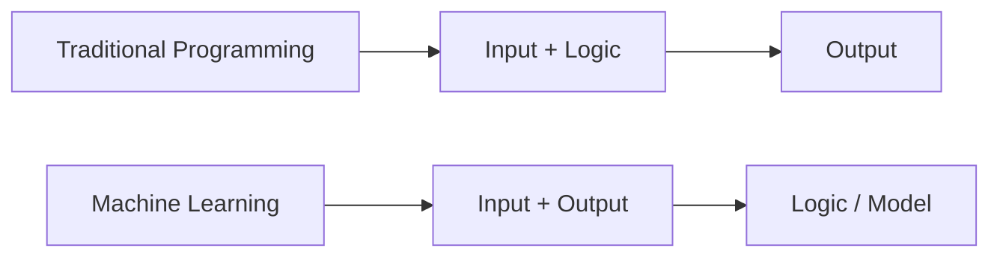

- **Traditional programming:** you give the computer the input *and* the logic (the rules/equation). It computes the output.
- **Machine Learning:** you give the computer the input *and* the output (real examples). The computer works out the logic itself. That discovered logic is saved as a **model**.

### Training vs. Inference — The Two Phases of ML

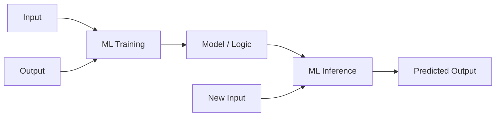

| Phase | What happens |
|---|---|
| **Training** | You feed the system many input-output examples. It studies them and derives the underlying logic/pattern, saved as a "model." |
| **Inference** | You give the trained model a brand-new input it has never seen. It applies the learned logic and produces a predicted output. |

**Example — spam detection:** Imagine training a human employee by showing them 10,000 past spam emails and 10,000 non-spam emails. They notice patterns (urgent language, suspicious sender IDs) and internalize a rule. A computer can be trained the exact same way — given enough labeled examples, it extracts its own patterns, without a programmer writing "if email contains X, mark as spam."

```javascript
// Traditional programming — you write the logic yourself
function isSpamOldWay(email) {
  if (email.includes("Win Money") || email.includes("Free Prize")) {
    return true;
  }
  return false;
}

// Machine Learning — you give input+output examples during training,
// the model derives the logic itself, then you call it at inference time
const trainingData = [
  { email: "Limited offer, win money now!", label: "spam" },
  { email: "Meeting notes attached", label: "not_spam" },
  // ...thousands more labeled examples
];

// await spamModel.train(trainingData);  // training phase — happens once, offline

const newEmail = "Congratulations, you've been selected for a reward!";
const prediction = await spamModel.predict({ email: newEmail }); // inference phase
console.log(prediction); // { label: "spam", confidence: 0.94 }
```

### The Two Major Categories of ML Tasks

**A. Classification** — mapping an input to one of a fixed set of categories.
- Email → spam / not spam (binary classification)
- Image → cat / dog (binary classification)
- News article → business / sports / technology / health (multiclass classification)

**B. Regression** — predicting a number, not a fixed category.
- Predicting a home's price based on bedrooms, area, and age (e.g., Zillow's "Zestimate," or Indian platforms like MagicBricks)
- Output can be *any* number (₹9,25,000 or ₹9,23,450) — there's no fixed set of possible answers, unlike classification.

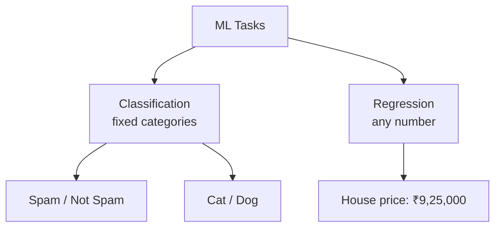

```javascript
// Classification — output is one of a fixed set of labels
const emailResult = await classifierModel.predict({ email: newEmail });
console.log(emailResult); // { label: "spam" }  — always one of: spam / not_spam

// Regression — output is a number, with no fixed set of possible values
const priceResult = await priceModel.predict({
  bedrooms: 3,
  areaSqft: 1400,
  ageYears: 5,
});
console.log(priceResult); // { predictedPrice: 9250000 } — could be any number
```

### Supervised vs. Unsupervised Learning

The input-output pairs used in training are also called **labeled data** — mathematically, input is X and output is Y.

| Type | Definition | Example |
|---|---|---|
| **Supervised Learning** | Trained on labeled data (X-Y pairs) — you tell the system the correct answer for each example | Emails already tagged spam/not spam |
| **Unsupervised Learning** | Trained on unlabeled data — the system finds its own patterns/groupings with no guidance | Grouping documents into folders by noticing shared patterns, with nobody specifying the categories in advance |

**A simple analogy for unsupervised learning:** imagine a child sorting a pile of mixed toys. If told "put dolls in this bucket, cars in that bucket," that's supervised — the categories were given. If instead told "just sort these into two groups, however you like," the child might group by color, by size, or by type — that's unsupervised: the pattern is discovered, not assigned.

**Real industry use cases of unsupervised learning:**
- **Clustering** — automatically grouping similar documents (legal docs, invoices, requirements) into folders based on shared patterns, without pre-labeling each one.
- **Outlier detection** — flagging data points that don't fit into any cluster (used in finance to detect anomalies in earnings estimates, for example).
- Common algorithms: K-Means, DBSCAN, Hierarchical Clustering.
- Common supervised algorithms: Linear Regression, Logistic Regression, Decision Trees, Random Forest, XGBoost.

```javascript
// Supervised learning — you provide labeled examples (X-Y pairs)
const labeledEmails = [
  { text: "Win money now!", label: "spam" },
  { text: "Project update attached", label: "not_spam" },
];
// await spamModel.train(labeledEmails); — model learns to map X (text) to Y (label)

// Unsupervised learning — you provide data with NO labels at all
const documents = [
  { text: "Invoice #1042, due 30 days" },
  { text: "Non-disclosure agreement, effective date..." },
  { text: "Invoice #1043, due 30 days" },
];
const clusters = await clusteringModel.fit(documents);
console.log(clusters);
// { cluster_1: ["Invoice #1042...", "Invoice #1043..."], cluster_2: ["Non-disclosure..."] }
// Nobody told the model "these are invoices" — it found the grouping itself
```

### Common Statistical ML Tooling

- **Language:** Python
- **Data handling:** Pandas, NumPy
- **Visualization:** Matplotlib, Seaborn
- **Development environment:** Jupyter Notebook
- **Model training libraries:** Scikit-learn, XGBoost

---

## 2. Deep Learning — When Data Gets Too Complex for Statistical ML

### Structured vs. Unstructured Data

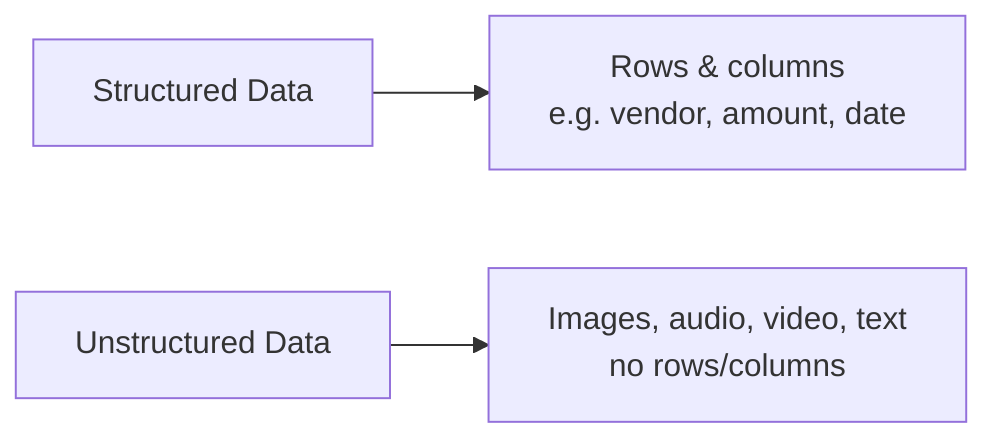

Statistical ML algorithms (Decision Trees, XGBoost) work well on structured, tabular data. They struggle on unstructured data — a photo is just a huge grid of pixel values with no natural "columns" the way a spreadsheet has. This gap is exactly what Deep Learning was built to close.

### How a Neural Network "Sees" — The Core Idea

A neural network breaks a complex recognition task into smaller sub-tasks, layer by layer, then combines the results:

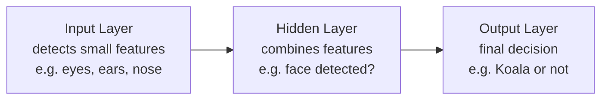

- Each neuron in the input layer specializes in detecting one small feature (e.g., "does this look like an eye?"), giving a confidence score between 0 and 1.
- A hidden layer combines several of these feature scores to make a higher-level judgment (e.g., "does this look like a face?"), often giving more weight to especially distinctive features.
- The output layer makes the final call using the hidden layer's judgments.
- **Training happens through trial and feedback:** the network makes a guess, an external check confirms whether it was right or wrong, and if wrong, that error signal flows backward through every layer so each part adjusts slightly for next time. This process is called **backward error propagation**, repeated over thousands of examples until accuracy improves.

**Definition, precisely:** Deep Learning is a Machine Learning technique that uses neural networks to learn from large amounts of data, loosely mimicking the brain's ability to recognize patterns — usually requiring far more training data than statistical ML.

```javascript
// You never build the neural network's layers yourself in application code —
// you call an already-trained Deep Learning model, same shape as any other model call
const result = await imageModel.classify({ imageUrl: "https://example.com/koala.jpg" });
console.log(result); // { label: "koala", confidence: 0.91 }

// Compare to the statistical ML calls above — the calling pattern is identical.
// What changed is what's INSIDE the model (layered neural network vs simpler statistics),
// not how you, as a developer, interact with it.
```

### Choosing Statistical ML vs. Deep Learning

| Criteria | Favor Statistical ML | Favor Deep Learning |
|---|---|---|
| Feature complexity | Simple, structured features | Complex features (images, video, audio) |
| Data type | Tabular (rows/columns) | Unstructured |
| Data volume | Works with smaller datasets | Usually needs large volumes of data |

These are guidelines, not hard rules — some problems with huge structured datasets still use Deep Learning; testing both is normal.

### Core Neural Network Architectures

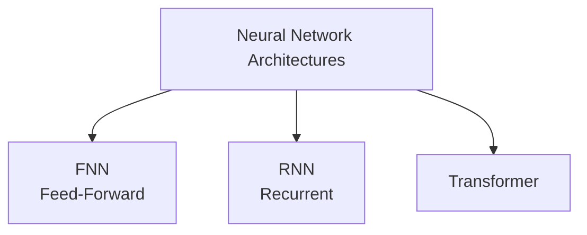

- **FNN (Feed-Forward Neural Network):** data flows one direction only — input to hidden to output — no loops. Like a juicer: fruit goes in one end, juice comes out the other.
- **RNN (Recurrent Neural Network):** processes sequences over a time dimension, feeding its own previous output back in as it goes — like adjusting a soup recipe repeatedly based on how it tastes at each step.
- **Transformer:** the architecture behind essentially all modern Generative AI and Agentic AI. GPT literally stands for **Generative Pre-trained Transformer** — Transformer is the underlying architecture; GPT is a specific approach built on it.

### Deep Learning Tooling

- **Frameworks:** PyTorch (by Meta, more beginner-friendly, more popular currently) and TensorFlow (by Google, more fine-grained control)
- **Hardware:** GPUs are essentially required — training on millions of records on a CPU alone isn't practical; GPUs can be local or rented in the cloud

---

## 3. Generative AI

**Definition:** Generative AI is the category of AI where the objective is to generate new content — text, images, audio, video, or code — rather than just predicting, classifying, or detecting something about existing input.

### Traditional AI vs. Generative AI, Compared Directly

| Aspect | Traditional AI | Generative AI |
|---|---|---|
| Purpose | Analyze, predict, classify, decide | Generate new content |
| Output type | Labels, yes/no, numbers | Creative — paragraphs, images, audio |
| Model types | Decision Trees, Linear Regression, SVM, other Deep Learning models | LLMs, GANs, Diffusion Models |
| Training approach | Supervised learning on labeled data | Pre-training on massive datasets (e.g., all of internet text) |
| Human-like capability | Limited | High — can perform creative tasks like writing poetry |
| Common tooling | XGBoost, Scikit-learn | LLM-based tools and APIs |

**Important nuance:** Generative AI didn't replace traditional AI. Spam classification, image classification, and price prediction are still solved with traditional statistical/Deep Learning models today — they're lightweight and well-suited to those specific problems. Both approaches coexist.

```javascript
// Traditional AI — output is a label/number, from a fixed set of possibilities
const spamResult = await spamModel.classify({ email: emailText });
console.log(spamResult); // { label: "not_spam" }

// Generative AI — output is brand new content, not picked from a fixed set
import Anthropic from "@anthropic-ai/sdk";
const anthropic = new Anthropic({ apiKey: process.env.ANTHROPIC_API_KEY });

const poem = await anthropic.messages.create({
  model: "claude-sonnet-4-5",
  max_tokens: 150,
  messages: [{ role: "user", content: "Write a short poem about samosas." }],
});
console.log(poem.content[0].text); // newly generated text, different every run
```

### Examples of Generative AI Models, by Content Type

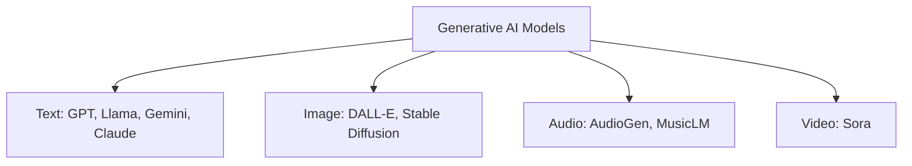

---

## 4. Large Language Models (LLMs)

### The "Stochastic Parrot" Analogy

Imagine a pet parrot named Buddy who has listened to every conversation in his owner's house. Buddy can mimic speech extremely well — if he hears "I'm feeling hungry," he's far more likely to say "biryani" or "food" next than "bicycle," purely because those words followed similar phrases often in what he's heard before. Buddy doesn't understand *meaning* — he's using statistical probability (plus some randomness) to guess the next likely word.

**A Large Language Model works on the same core principle, at a vastly larger scale:**
- A basic language model is trained on one narrow dataset (e.g., movie-related Wikipedia articles) and predicts likely next words for that domain — this is what powers something like Gmail's autocomplete.
- A **Large** Language Model is trained on a massive volume of data — Wikipedia, books, news articles, and far more — using a neural network with billions or trillions of internal parameters, letting it capture much more complex and nuanced language patterns.

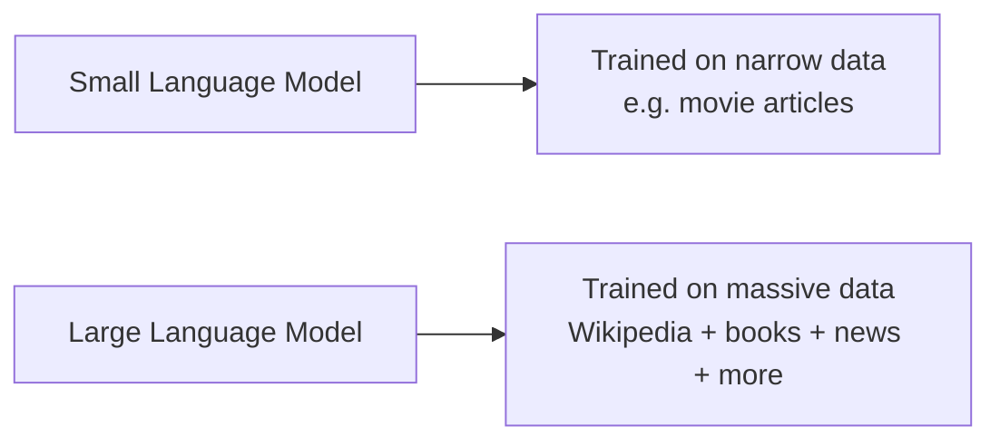

### RLHF — Reinforcement Learning with Human Feedback

Continuing the analogy: if Buddy overheard abusive language and started repeating it, his owner would need to actively correct him — showing him multiple possible responses and marking which ones are acceptable, until Buddy stops repeating the toxic ones.

This is exactly what **RLHF** does for LLMs: after initial training, human reviewers evaluate multiple possible model responses to the same prompt and indicate which are better/safer, and the model is further trained on that feedback — this is how tools like ChatGPT were made less toxic and more aligned with what's actually helpful, beyond raw statistical prediction alone.

```javascript
// A basic LLM call — the model predicts the most likely next tokens,
// shaped by both its original training AND RLHF alignment on top of it
const response = await anthropic.messages.create({
  model: "claude-sonnet-4-5",
  max_tokens: 100,
  messages: [{ role: "user", content: "I'm feeling hungry, what should I eat?" }],
});
console.log(response.content[0].text);
// Response is helpful and safe — a direct result of RLHF shaping the raw
// statistical prediction the base model would otherwise produce
```

---

## 5. Workflows, AI Agents, and Agentic AI

Anthropic distinguishes two broad categories of applications you can build using an LLM: **workflows** and **agents**.

### Level 1 — A Simple RAG Chatbot (Workflow)

An HR chatbot that answers policy questions (e.g., "how many leave days do I get?") by looking up an organization's private PDF documents using **Retrieval-Augmented Generation (RAG)**.

- **Reactive:** you ask, it answers from the retrieved documents.
- Not an agent — it never takes any action, only answers questions.

### Level 2 — A Tool-Augmented Chatbot (Still a Workflow)

The same chatbot, but now connected to the company's HR system's APIs — so it can check your actual leave balance and even file a leave request on your behalf.

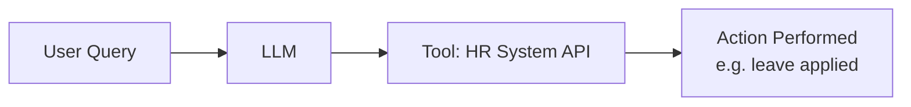

- Still not a true "agent" in the fullest sense — it performs one specific, simple task per request, without broader autonomy.

### Level 3 — A True Agentic System

A request like *"onboard the new intern joining next Monday"* — with no step-by-step instructions given.

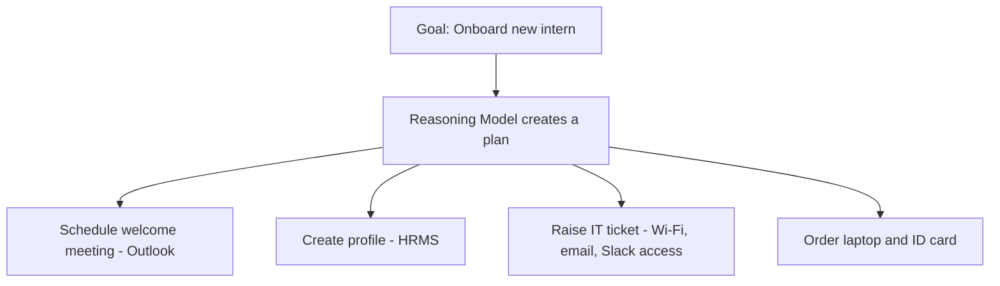

**Characteristics that define this as truly agentic:**
- **Goal-oriented planning** — given only a goal, not detailed steps.
- **Multi-step reasoning** — it breaks the goal into an ordered sequence of sub-tasks.
- **Autonomous decision-making** — it performs the actions itself, rather than only suggesting them.
- **Tool, knowledge, and memory access** — it's connected to multiple systems (Outlook, HRMS, IT ticketing) and can use each one as needed.

```javascript
// Level 1 — Simple RAG chatbot: reactive, no actions
const ragAnswer = await anthropic.messages.create({
  model: "claude-sonnet-4-5",
  max_tokens: 200,
  system: `Answer using only this policy doc:\n${policyDocText}`,
  messages: [{ role: "user", content: "How many sick leave days do I get?" }],
});

// Level 2 — Tool-augmented chatbot: one action, still simple
const tools = [{
  name: "applyLeave",
  description: "Apply for leave on behalf of the logged-in employee",
  input_schema: { type: "object", properties: { days: { type: "number" } }, required: ["days"] },
}];
const toolResponse = await anthropic.messages.create({
  model: "claude-sonnet-4-5",
  max_tokens: 200,
  tools,
  messages: [{ role: "user", content: "Apply for 2 days of leave for me." }],
});
// Your code executes toolResponse's tool_use block against the real HR API

// Level 3 — Agentic system: goal given, multi-step plan executed autonomously
async function onboardIntern(internName, startDate) {
  const plan = await anthropic.messages.create({
    model: "claude-sonnet-4-5",
    max_tokens: 500,
    tools: [scheduleTool, hrmsTool, itTicketTool, orderEquipmentTool],
    messages: [{ role: "user", content: `Onboard ${internName}, starting ${startDate}.` }],
  });
  // The model reasons through the goal, calling multiple tools in sequence:
  // scheduleTool -> hrmsTool -> itTicketTool -> orderEquipmentTool
  // Your code executes each requested tool call and feeds results back until done
}
```

### Defining the Three Related Terms Precisely

| Term | Definition |
|---|---|
| **AI Agent** | A single component that can perceive its environment, make decisions, and take actions to achieve a specific goal — powered by an LLM. |
| **Agentic AI** | A system containing one or more (often advanced) AI agents, capable of complex reasoning and multi-step autonomous action. |
| **Generative AI** | The specific component/capability of generating new content (text, summaries, extracted information) — often used *inside* an agent, but not the same thing as the agent itself. |

**Autonomy**, precisely: the freedom for the system to take an action on its own — like sending an email or creating a ticket — without asking for confirmation at every step.

### Generative AI vs. Agentic AI — Direct Comparison

| Aspect | Generative AI | Agentic AI |
|---|---|---|
| Purpose | Create new content | Reason, plan, and act toward a goal |
| Output | Unstructured content (text, audio, image) | Actions performed in the real system |
| Autonomy | Very little to none — waits for each prompt | High — plans and acts with minimal instruction |
| Planning | Minimal | Multi-step, detailed |
| Tool usage | Usually minimal | Heavy — accesses multiple external tools |
| Behavior style | Reactive | Proactive |

**A useful way to hold both ideas at once:** Generative AI is a *component* that lives inside an Agentic AI system (the part that drafts the welcome email or summarizes a document) — but Agentic AI is the larger system that decides *what* needs to happen, plans the steps, and *executes* them using tools, memory, and reasoning. Simple Q&A with ChatGPT is Generative AI; ChatGPT performing multi-step deep research by browsing, comparing sources, and synthesizing an answer autonomously is Agentic AI.

### Common Tooling for Building Agentic Systems

- Code-based frameworks: Agno, Google's Agent Development Kit, OpenAI's agent toolkit
- No-code/low-code: n8n, Zapier — drag-and-drop workflow builders that connect an LLM to external tools (Jira, Slack, calendars) without writing code

---

## Full Picture — Where Everything Sits

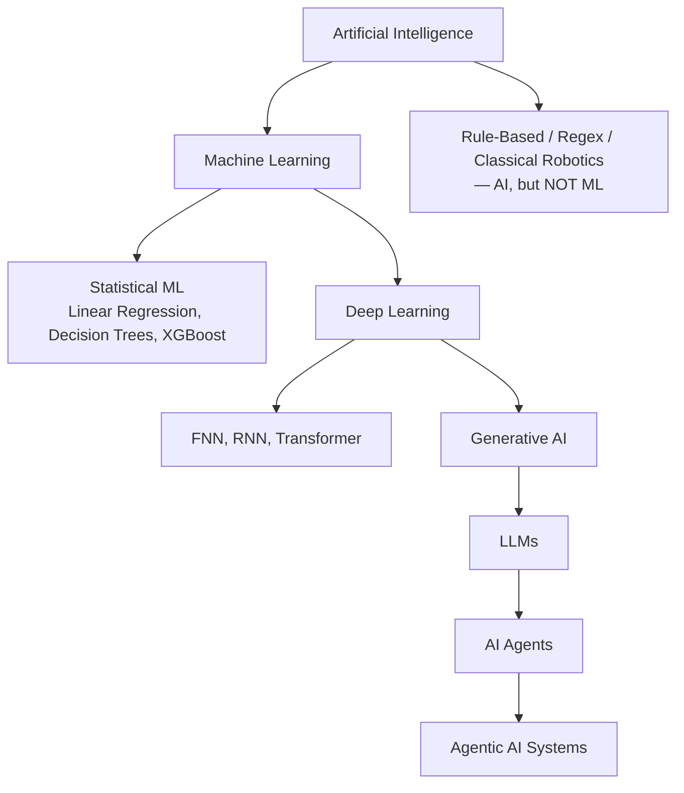

**Next:** exploring supervised learning algorithms individually — Linear Regression, Logistic Regression, Decision Trees — with real code.
