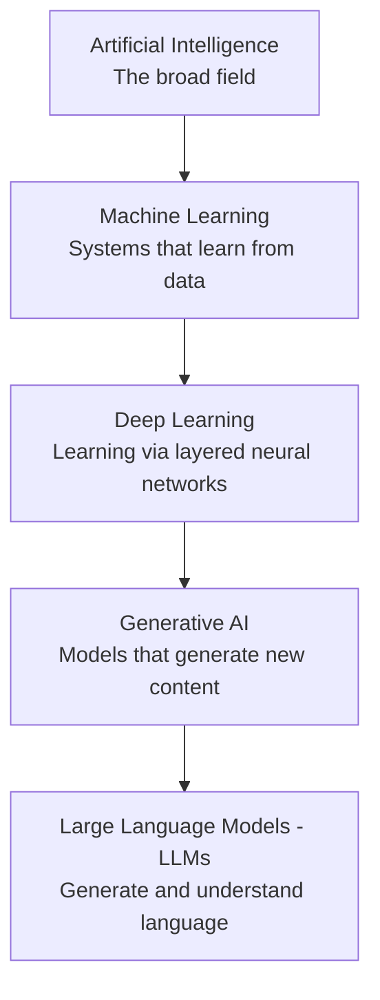
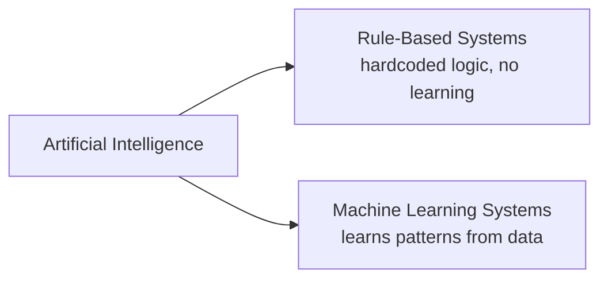
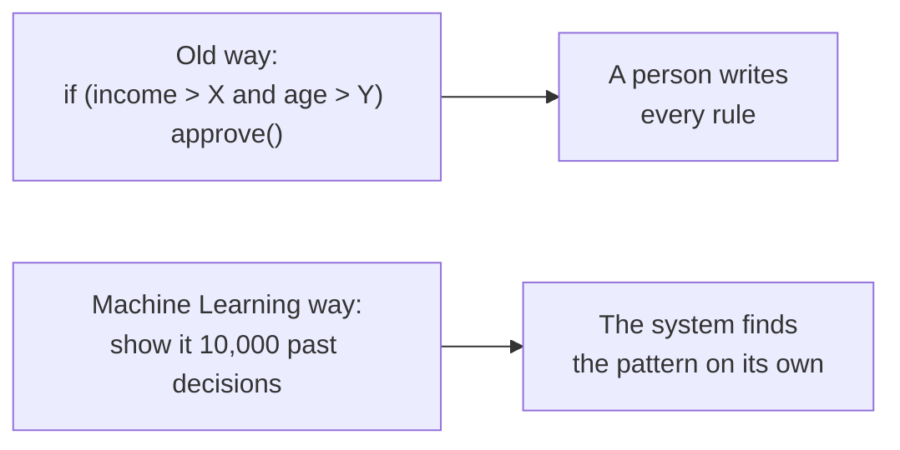
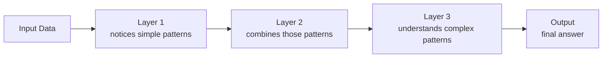
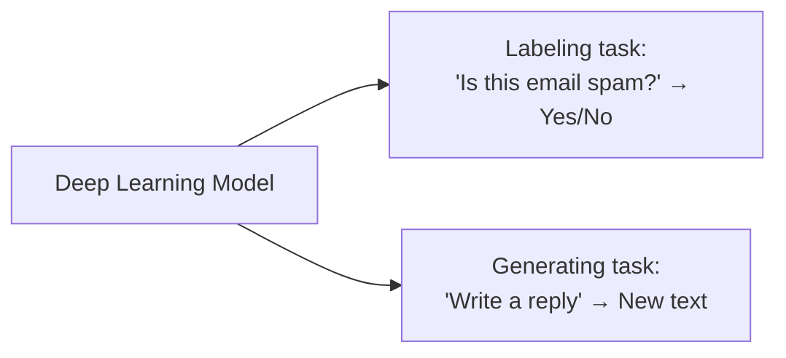
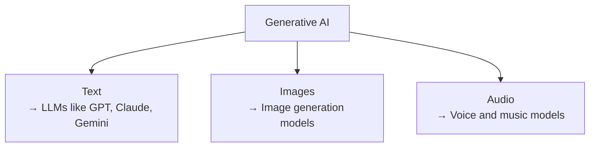

# AI for Software Developers

## Introduction

You already know how to build software — you understand code, logic, data, and systems. What you're starting now is AI: a new layer of knowledge that sits on top of the skills you already have, not a replacement for them.

The problem is that "AI," "Machine Learning," and "LLM" get used like they're interchangeable — they're not, and that confusion is where most self-taught understanding of AI breaks down later. These notes exist to fix that, one concept at a time, written specifically for someone who already thinks like a developer.

No Python, no math degree, no data science background required. Each topic comes with a diagram, a plain-language explanation, and working code, built up in an order where nothing depends on something you haven't read yet.

We start at the foundation: what does "AI" actually mean, and how do Machine Learning, Deep Learning, Generative AI, and LLMs all fit inside it?

---

## The AI Hierarchy

"AI," "Machine Learning," and "LLM" are not the same thing. They are five layers, nested one inside the other — like boxes inside boxes.



**The rule:** every layer sits inside the layer above it.
- Every LLM is Generative AI
- Every Generative AI model is Deep Learning
- Every Deep Learning model is Machine Learning
- Every Machine Learning system is AI

It never works the other way around.

---

### 1. Artificial Intelligence (AI)

AI is the biggest box. It means: **a machine behaving in a way that looks intelligent.**

It doesn't need to "learn" anything. A 1990s chess program running fixed rules (`if the opponent moves here, respond like this`) still counts as AI — no data, no learning, just smart-looking rules written by a person.



The term "AI" goes back to 1956 — decades before anything like ChatGPT existed.

```javascript
// This is genuine AI — no learning, no data, just rules. It still "behaves" intelligently.
function chessMove(opponentMove) {
  if (opponentMove === "e4") return "e5";
  if (opponentMove === "d4") return "d5";
  return "knightToF3"; // a fixed, hardcoded response for every case
}
```

**What this code is showing, point by point:**

- **The goal of the example:** prove that "AI" doesn't require learning or data at all — just behavior that *looks* intelligent from the outside.
- **`function chessMove(opponentMove) {`** — a plain function that takes one input: whatever move the opponent just played (for example, `"e4"`).
- **`if (opponentMove === "e4") return "e5";`** — if the opponent plays the pawn move `e4`, always respond with `e5`. This isn't a decision the program "thinks through" — it's a fixed rule a person typed in ahead of time, based on known chess opening theory.
- **`if (opponentMove === "d4") return "d5";`** — the same idea again: another fixed opening response. Play `d4`, always get `d5` back.
- **`return "knightToF3";`** — the fallback. If the opponent's move doesn't match any rule the programmer thought of, fall back to a generic, safe move. Still entirely hardcoded — nothing here was learned.
- **Why this still counts as AI:** someone watching this play chess would say it looks intelligent. But there's no data behind it, no training, no pattern recognition — just `if/else` logic written in advance by a human.
- **The line this example is drawing:** AI is about the *appearance* of intelligent behavior, not about learning. The moment this hardcoded logic gets replaced with something that *learns* the best response from thousands of real games instead of being told the rules directly, it crosses from plain AI into Machine Learning — the next topic.

---

### 2. Machine Learning (ML)

This is where real "learning" begins. Instead of a person writing the rules, the system looks at data and works out the pattern itself.



| Type | In plain words | Example |
|---|---|---|
| Supervised Learning | Learns from examples that already have the correct answer attached | An email already marked "spam" or "not spam" |
| Unsupervised Learning | Finds patterns in data with no answers given at all | Grouping customers by similar buying habits |
| Reinforcement Learning | Learns by trying things and getting rewarded or punished | A system earning points for good moves in a game |

```javascript
// Old way — a person writes every rule by hand
function approveLoanOldWay(income, age) {
  if (income > 50000 && age > 21) return "approved";
  return "rejected";
}

// Machine Learning way — the system learned this decision from past data
// (you don't write the rule; a trained model produces the decision)
const decision = await loanModel.predict({ income: 62000, age: 27 });
console.log(decision); // e.g. "approved" — based on patterns learned from 10,000 past cases
```

---

### 3. Deep Learning (DL)

Regular Machine Learning struggles with complex data — photos, audio, long text. Deep Learning was built to handle exactly that, using a **neural network**: many small units stacked in layers, each layer building on what the layer before it noticed.



"Deep" simply means many layers stacked together.

Two neural network types worth knowing:
- **CNN (Convolutional Neural Network)** — built for images, scans small parts of a picture and builds up the full understanding.
- **RNN (Recurrent Neural Network)** — built for text, reads word by word trying to remember what came before, but often forgets the start of a long sentence by the time it reaches the end. This weakness led to the Transformer, the design behind every modern LLM.

```javascript
// You don't build a neural network yourself — you call a model that already has one
// Example: an image classifier built on a CNN, accessed via an API
const result = await visionModel.classify({ imageUrl: "https://example.com/photo.jpg" });
console.log(result); // { label: "cat", confidence: 0.97 }
```

---

### 4. Generative AI

Not every Deep Learning model creates something new — some just label things that already exist.



A spam filter picks a label. A tool that writes a full reply email creates something brand new. That's Generative AI — the layer where the model *makes* something instead of just sorting it.

```javascript
// Classification (Deep Learning, NOT Generative AI) — outputs a label
const spamCheck = await spamModel.classify({ email: emailText });
console.log(spamCheck); // { label: "not_spam" }

// Generation (Generative AI) — outputs brand new text
const reply = await anthropic.messages.create({
  model: "claude-sonnet-4-5",
  max_tokens: 150,
  messages: [{ role: "user", content: "Write a polite reply declining this meeting request." }],
});
console.log(reply.content[0].text); // newly generated text, not a label
```

---

### 5. Large Language Models (LLMs)

LLMs are Generative AI's language specialist — trained on huge amounts of text, built to understand and produce human language.



This is the layer you'll actually work with most going forward.

```javascript
import Anthropic from "@anthropic-ai/sdk";
const anthropic = new Anthropic({ apiKey: process.env.ANTHROPIC_API_KEY });

const response = await anthropic.messages.create({
  model: "claude-sonnet-4-5",
  max_tokens: 100,
  messages: [{ role: "user", content: "What is an LLM, in one sentence?" }],
});

console.log(response.content[0].text);
```

---

## Putting It All Together

| Real Example | Where It Sits |
|---|---|
| A 1990s chess program with fixed rules | AI only |
| A spam filter trained on labeled emails | AI → ML |
| Face recognition on your phone | AI → ML → Deep Learning |
| A tool that writes marketing text | AI → ML → Deep Learning → Generative AI → LLM |
| ChatGPT, Claude, Gemini | AI → ML → Deep Learning → Generative AI → LLM |

**One line to remember:** every LLM is Generative AI, every Generative AI model is Deep Learning, every Deep Learning model is Machine Learning, every Machine Learning system is AI — and it never runs backward.

---

**Coming next:** Types of Machine Learning, in more depth.
