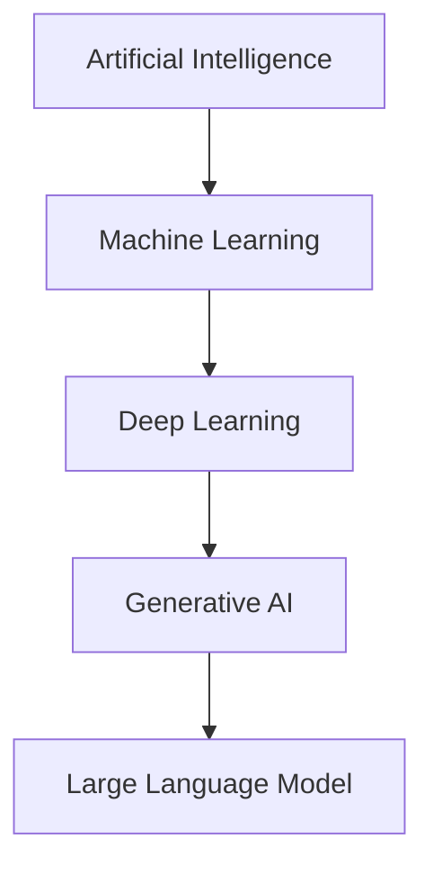
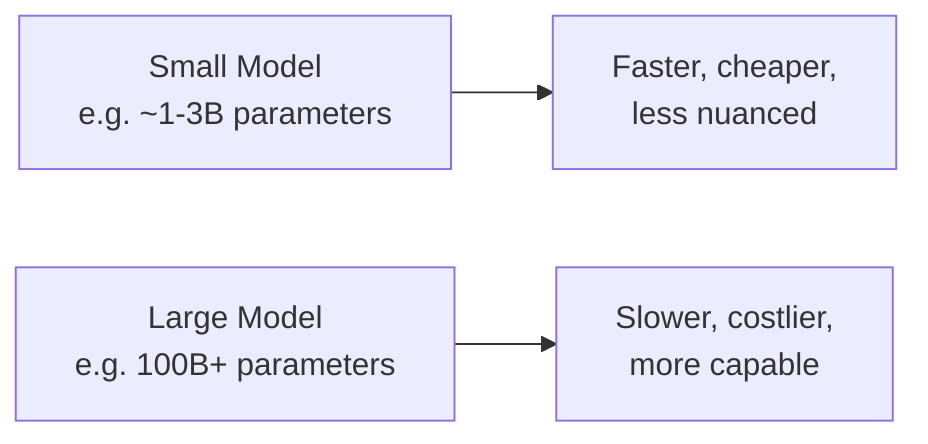
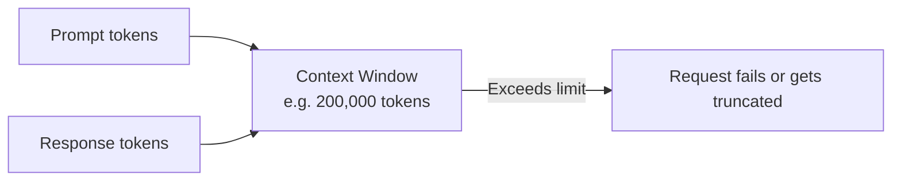
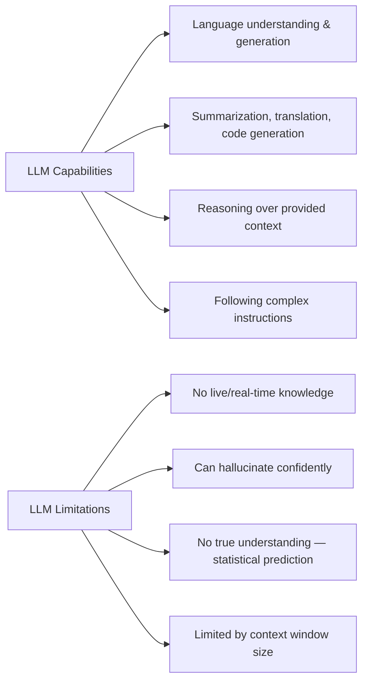
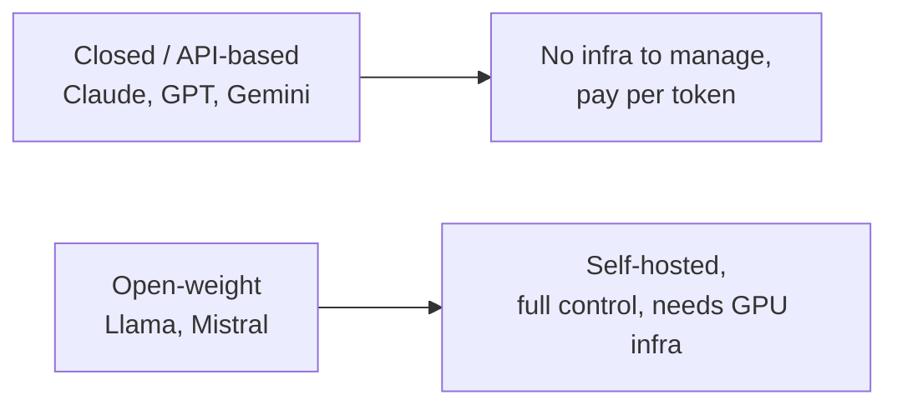

# LLM Fundamentals

These notes cover the foundational concepts you need before working with any LLM in an application — what an LLM actually is, the properties that define it, what it can and can't do, and how to reason about choosing one. This sits above the internals covered in [How LLMs Work Internally](./How-LLMs-Work-Internally.md) — that file explains *how* an LLM generates text token by token; this one covers what you need to know to actually *use* one.

---

## 1. What Is an LLM?

**Definition:** A Large Language Model is a Generative AI model, built on the Transformer architecture, trained on massive amounts of text data, specialized in understanding and generating human language.



The word "Large" isn't decorative — it refers to two things being large at once: the **training data** (trillions of words, spanning books, websites, code, conversations) and the **model itself** (billions to trillions of internal parameters). Both scale together — a model trained on a huge dataset but with too few parameters can't actually absorb everything in that data; a model with huge parameters but too little data has nothing to learn from.

---

## 2. The Core Properties That Define an LLM

### 2.1 Parameters

**Parameters** are the internal numerical values (weights) the model adjusts during training — they're what actually stores everything the model "knows." More parameters generally means the model can represent more complex patterns in language, but also means it costs more to run.



### 2.2 Context Window

The **context window** is the maximum amount of text (measured in tokens) a model can consider at once — your prompt, any conversation history, and the response combined.



A larger context window lets you paste in longer documents, keep longer conversation history, or work with bigger codebases in a single request — directly relevant when deciding which model fits a RAG or long-document use case.

### 2.3 Training Data Cutoff

Every LLM's knowledge is frozen at whatever point its training data was collected — it has no built-in awareness of anything that happened after that date, unless you explicitly give it that information (through RAG, tool use, or web search).

```javascript
// The model has no live knowledge of events after its training cutoff —
// this is exactly why RAG and tool use exist: to give it fresh, current information
const response = await anthropic.messages.create({
  model: "claude-sonnet-4-5",
  max_tokens: 200,
  messages: [{ role: "user", content: "What's today's weather in Pune?" }],
});
// The model cannot know this on its own — it needs a tool call to a weather API
```

### 2.4 Temperature

Covered in depth in the internals notes — a setting from 0 to 1 controlling how deterministic (low) vs. varied/creative (high) the output is.

---

## 3. Capabilities vs. Limitations



**Hallucination**, precisely: an LLM will sometimes generate text that sounds fluent and confident but is factually incorrect — because it's fundamentally predicting the most statistically likely next tokens, not looking up verified facts. This is the single most important limitation to design around when building real applications — never trust an LLM's factual claims without validation, especially for anything high-stakes.

---

## 4. The Major LLM Families, at a Glance

| Provider | Model family | Notable strength |
|---|---|---|
| Anthropic | Claude | Strong at coding, long-context reasoning, agentic tasks |
| OpenAI | GPT | Broad ecosystem, widely integrated |
| Google | Gemini | Deep integration with Google Cloud/Workspace |
| Meta | Llama | Open-weight, self-hostable |
| Mistral | Mistral | Open-weight, efficient smaller models |

**Closed vs. open models:**



For almost every backend-integrated feature, calling a closed model via API is the right default — it requires zero infrastructure. Open-weight models become relevant when you need full data control, offline operation, or heavy customization through fine-tuning.

---

## 5. Prompting — The Interface to an LLM

A **prompt** is the entire interface you have to an LLM — there's no separate "settings panel" the way there is for a database. Two parts matter:

- **System prompt** — sets the model's overall behavior for the whole interaction (its role, tone, constraints).
- **User prompt** — the specific request for this particular call.

```javascript
const response = await anthropic.messages.create({
  model: "claude-sonnet-4-5",
  max_tokens: 300,
  system: "You are a concise technical assistant. Never use more than 3 sentences.",
  messages: [{ role: "user", content: "What is a context window?" }],
});
```

This is covered in far more depth in later notes on prompt engineering and structured output — the point here is just to recognize that prompting *is* the API surface of an LLM, the same way a function signature is the API surface of a library.

---

## Summary

| Concept | One-line meaning |
|---|---|
| Parameters | The internal values that store what the model "knows" |
| Context window | Max tokens (prompt + response) it can handle per request |
| Training cutoff | The date after which the model has no built-in knowledge |
| Temperature | Setting controlling randomness/creativity of output |
| Hallucination | Confident but factually wrong generated text |
| Closed model | API-based, no infrastructure to manage (Claude, GPT, Gemini) |
| Open-weight model | Self-hosted, full control (Llama, Mistral) |

**Next:** Prompt Engineering and Structured Output — how to reliably get the exact shape of response your application needs.
