# How LLMs Actually Work, Inside the Transformer

These notes unpack what happens internally when you send a prompt to a model like ChatGPT, Claude, or Gemini — from the raw text you type down to the next word it predicts. As an application developer you don't need this level of depth to build with LLMs, but understanding it once removes the "magic" and replaces it with a clear mental model of what an API call is actually doing behind the scenes.

---

## 1. What GPT Actually Stands For

GPT stands for **Generative Pre-trained Transformer**. Each word describes a real property of the model:

- **Generative** — it creates new content, rather than retrieving stored answers. This is the key difference from a traditional search engine: Google, Bing, and similar tools crawl and index the web, then retrieve the most relevant existing page for your query. An LLM never retrieves a stored answer — it generates a new sequence of text on the spot, based on your input.
- **Pre-trained** — it has no innate intelligence "by birth." Its ability to generate coherent text comes entirely from having previously been trained on massive amounts of text — books, internet data, conversations, historical documents.
- **Transformer** — the specific neural network architecture that makes this generation possible.

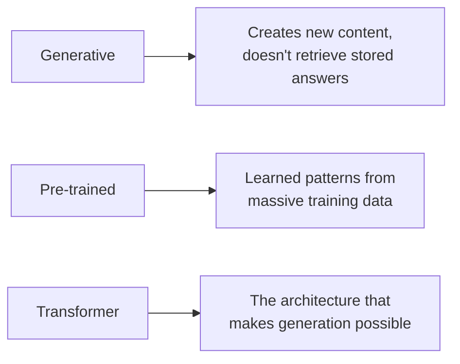

## 2. What Is a Transformer?

A Transformer is a neural network that takes an input sequence and transforms it into an output sequence — hence the name. It can take text and transform it into more text, into an image, into audio, or between languages (Google Translate, in fact, was one of the first practical applications of this architecture when Google introduced it in the 2017 paper *"Attention Is All You Need"*).

For an LLM specifically, the Transformer's job in its simplest form is: **given some input text, predict the single most likely next word.**

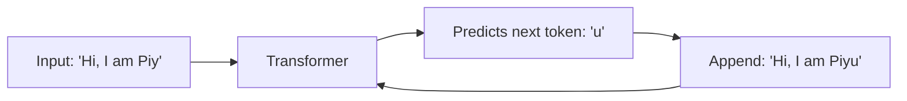

This predict-then-append cycle repeats — this is genuinely just a very well-tuned autocomplete, run over and over until the model produces a special "end of sequence" signal telling it to stop.

---

## 3. Step 1 — Tokenization

Computers don't understand letters the way humans do — they work far more efficiently with numbers. So the first step is converting your input text into numbers, called **tokens**.

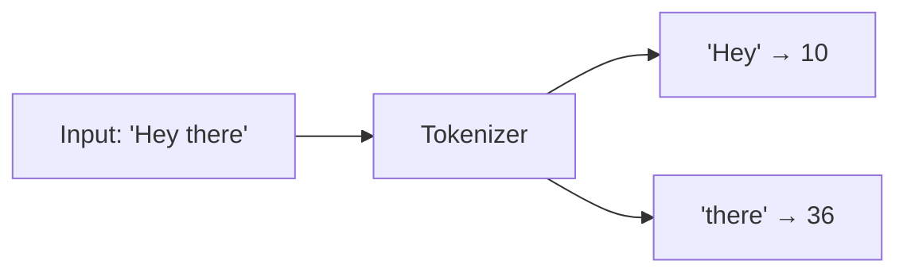

A simple version of this could map single letters to numbers (A=1, B=2, C=3...), but real models use a more efficient scheme where common word-chunks each get their own token. Every model has its own fixed **vocabulary** — the complete dictionary of chunk-to-number mappings it was built with. A larger vocabulary means the model can represent more complex text with fewer tokens; a smaller vocabulary means simpler words get broken into more individual pieces.

**Example in code (Python, using Hugging Face's `transformers` library):**

```python
pip install transformers

from transformers import AutoTokenizer

tokenizer = AutoTokenizer.from_pretrained("google/gemma")
tokens = tokenizer("Hey there")
print(tokens)
# Real tokenization depends entirely on the specific model's vocabulary —
# "Hey there" might become 3-4 tokens, each mapped to a fixed number
```

Different models tokenize the exact same text differently — GPT-4 might split "Hey there" into a different number of tokens than Gemini does, because each has its own vocabulary built during training.

---

## 4. Step 2 — Vector Embeddings

Every word carries meaning, and related words share related meaning. If you read the word "cat," a whole set of associations comes to mind — and if you then read "cat's favorite food is ___," most people fill in "milk." Change the sentence to "Pedigree is ___," and most people say "dog," because Pedigree is a dog food brand. Humans make this connection because we've observed these relationships in the real world.

A **vector embedding** is a numerical representation of a word (or token) that captures exactly this kind of semantic relationship. Words with related meaning end up positioned close together when plotted in this numerical space.

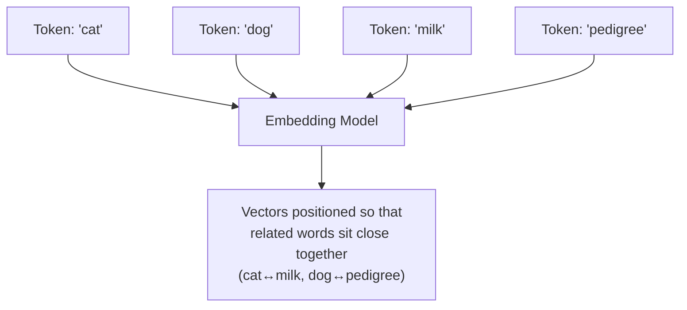

The intuition: if you measure the direction and distance between "cat" and "milk" in this space, and then apply that same direction and distance starting from "dog," you land near "pedigree" — because the underlying relationship ("this animal's associated food/brand") is the same for both pairs. The same logic connects "dog is an animal" to "man is a human," and can even extend further ("man likes sandwich," by the same relative distance used for "dog likes pedigree"). This is how a Transformer captures real-world relationships between words purely as geometry in a numerical space.

In practice, an embedding is a fixed-size list of numbers (a vector) — commonly 512, 1536, or higher dimensions, depending on the model. More dimensions can capture more nuanced meaning; fewer dimensions lose some of that nuance but are cheaper to compute with.

**Example in code (using OpenAI's embeddings API):**

```python
client = OpenAI()

response = client.embeddings.create(
    input="Cat loves milk",
    model="text-embedding-3-small"
)

print(response.data[0].embedding)
# A list of ~1536 numbers representing this sentence's meaning
print(len(response.data[0].embedding))  # 1536
```

---

## 5. Step 3 — Positional Encoding

Tokenizing and embedding word-by-word has a gap: it loses track of *where* each word sits in the sentence. Consider these two sentences:

- "The dog chased the cat."
- "The cat chased the dog."

Both sentences use the exact same set of words — "the," "dog," "chased," "cat" — so if you only tokenized and embedded each word individually, both sentences would look nearly identical to the model, even though they mean the opposite thing.

**Positional encoding** solves this by adding extra information about each token's position in the sequence directly into its embedding — mathematically combining the original embedding with a position-based adjustment (calculated using sine and cosine functions in the original Transformer design), producing a new, position-aware version of that embedding.

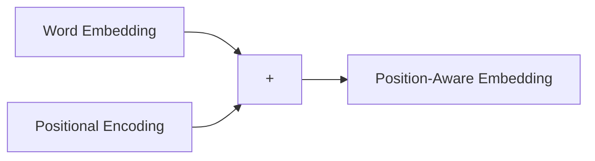

This step ensures the model knows not just *what* words are present, but *in what order* — which is essential, since word order is often the entire difference in meaning between two sentences.

---

## 6. Step 4 — Self-Attention

Before the Transformer architecture existed (pre-2017), models like RNNs processed one token at a time, sequentially. This created two problems: it was slow (nothing could be processed in parallel), and it lost context. Consider: "The river bank" vs. "The ICICI bank." Both contain the word "bank," and if each word is embedded in isolation, "bank" gets the same representation in both sentences — even though the two meanings are completely different.

**Self-attention** solves this by allowing tokens to "talk" to each other and adjust their own embeddings based on surrounding context.

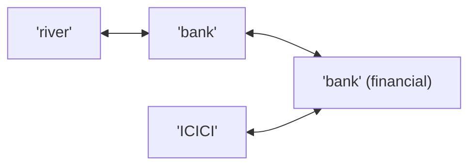

When "bank" appears near "river," self-attention shifts its embedding toward the "riverbank" meaning. When "bank" appears near "ICICI," it shifts toward the "financial institution" meaning. Mechanically, this involves taking the matrix of embeddings, computing it against its own transpose, scaling by the square root of the model's dimension size, and using the result to determine how strongly each word should influence every other word's embedding — but the concept to hold onto is simple: **self-attention lets nearby words reshape each other's meaning, preserving context that word-by-word processing would otherwise lose.**

---

## 7. Step 5 — Multi-Head Attention

Self-attention alone gives one "pass" at understanding context. **Multi-head attention** runs several of these attention processes in parallel, each one able to notice a different kind of relationship at the same time.

**An analogy:** imagine watching a video of a dog on a train, and afterward describing what you saw. One part of your attention noticed *where* it happened ("the dog was in the train"), another noticed *what the dog was doing* ("the dog was sleeping"), and another noticed *a visual detail* ("the dog was brown"). You processed all three observations simultaneously, then combined them into one full understanding.

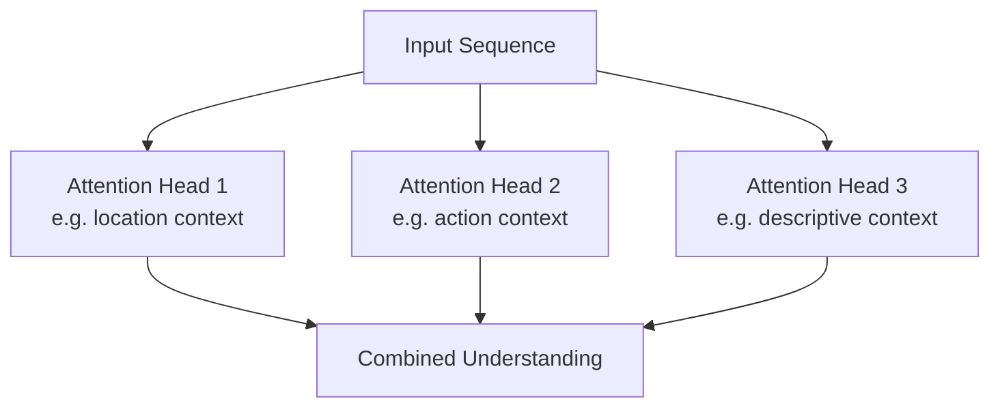

Multi-head attention is why LLMs maintain such strong contextual understanding — every head can specialize in noticing something different about the relationships between words, and combining all of those observations produces a far richer understanding than any single attention pass could.

---

## 8. Encoder and Decoder — The Full Architecture

Putting the previous steps together, the standard Transformer has two halves:

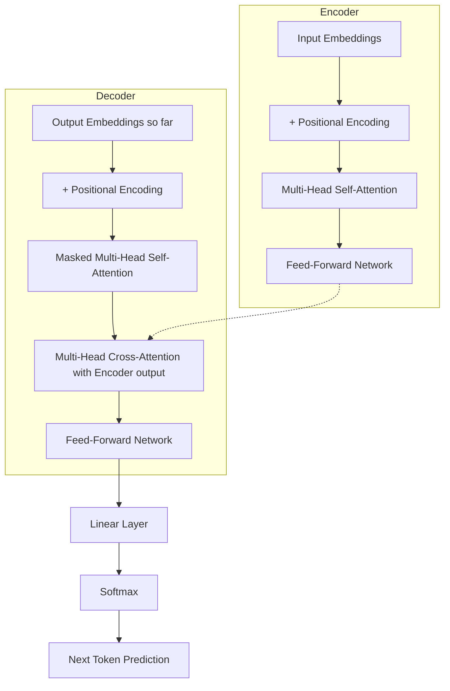

- The **Encoder** processes your input text — tokenizing it, embedding it, adding positional information, and running it through self-attention and a feed-forward layer to build a rich contextual representation.
- The **Decoder** takes that encoded representation plus whatever output has been generated so far (starting from a special "start of sequence" marker), and predicts the next token.
- This entire encoder+decoder cycle repeats — each newly predicted token gets appended to the sequence and fed back in — until the model produces an "end of sequence" token, signaling the response is complete.

---

## 9. Linear Layer and Softmax — How the Next Word Gets Chosen

At the very end of the decoder, two final steps determine the actual output token:

- **Linear layer:** produces a raw probability score for every single token in the model's vocabulary — how likely is *this* token to be the correct next one, versus every other possible token.
- **Softmax:** a function that converts those raw scores into a clean probability distribution and picks which token to actually output.

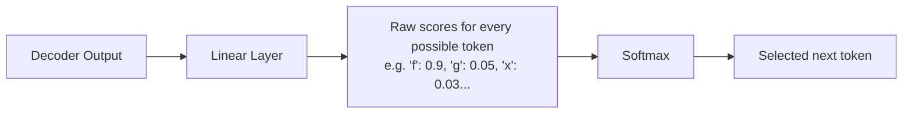

**Temperature** is the setting that controls how "creative" this selection is. At low temperature, softmax almost always picks the single highest-probability token — safe, consistent, predictable output. At higher temperature, it becomes more willing to select lower-probability tokens instead — more varied, more creative, sometimes less predictable output. This is exactly the "temperature" slider you'll find in tools like Google AI Studio or the Anthropic/OpenAI APIs.

```python
# Low temperature — consistent, safe output
response = client.messages.create(
    model="claude-sonnet-4-5",
    max_tokens=100,
    temperature=0.1,
    messages=[{"role": "user", "content": "Hi"}]
)

# High temperature — more varied, more "creative" output
response = client.messages.create(
    model="claude-sonnet-4-5",
    max_tokens=100,
    temperature=0.9,
    messages=[{"role": "user", "content": "Hi"}]
)
```

---

## 10. Training vs. Inference — The Two Modes an LLM Runs In

Every LLM operates in one of two modes, and it's worth being precise about the difference:

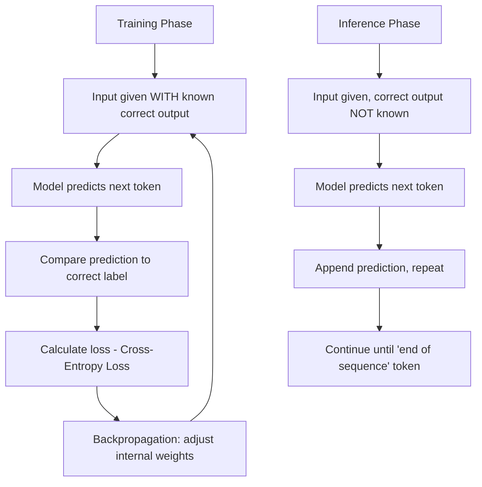

**Training phase:** the model is given an input ("Hi, how are you") alongside its known correct output ("I am fine"). It generates a prediction, compares that prediction against the correct label, and calculates how wrong it was using a method called **cross-entropy loss**. That error is then propagated backward through every layer of the network — a process called **backpropagation** — nudging the model's internal weights so that next time, its prediction moves closer to the correct answer. Repeated across millions of examples, this is how the model's weights gradually improve.

**Inference phase:** this is what happens every time you actually use the model (in ChatGPT, Claude, or your own application) — no correct answer is known in advance, and no backpropagation happens. The model simply generates its best next-token prediction, appends it, and repeats the cycle until it produces an end-of-sequence signal.

**The practical takeaway:** as an application developer, you only ever interact with a model in inference mode. Training is an entirely separate, offline process done once (or periodically) by the model provider — you're always calling an already-trained model and asking it to generate, never retraining it live through your API calls.

---

## 11. Seeing It End to End in Code

```python
from transformers import AutoTokenizer, AutoModelForCausalLM
import torch

model_name = "google/gemma-2b"
tokenizer = AutoTokenizer.from_pretrained(model_name)
model = AutoModelForCausalLM.from_pretrained(model_name, torch_dtype=torch.bfloat16)

# Step 1 — Tokenization
input_tokens = tokenizer("Write a Python code for adding two numbers", return_tensors="pt")

# Steps 2-9 happen internally inside model.generate() —
# embeddings, positional encoding, self-attention, multi-head attention,
# linear + softmax — repeated token by token
gen_out = model.generate(**input_tokens, max_new_tokens=100)

# Final step — convert generated tokens back into human-readable text
print(tokenizer.batch_decode(gen_out))
```

Everything from Sections 3 through 9 — tokenizing, embedding, encoding position, running attention, and picking the next token — happens automatically inside that single `model.generate()` call. As an application developer using an API (Claude, GPT, Gemini) rather than running a model yourself, even this much is abstracted away — you simply send text and receive text back.

---

## The Full Picture

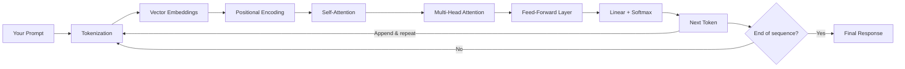

As a builder of AI-integrated applications, you don't need to implement any of this yourself — it's genuinely comparable to how you use Node.js without needing to know the internals of the V8 engine that runs it. What matters is having a correct mental model of what's happening when you call an LLM API: your text gets tokenized, converted into meaning-bearing vectors, given positional and contextual awareness through attention, and then — one token at a time, guided by a probability distribution you can tune with temperature — turned into the response you see. Going deeper into the underlying mathematics is valuable specifically if you want to become an AI research engineer; for building applications on top of these models, this level of understanding is genuinely enough.
